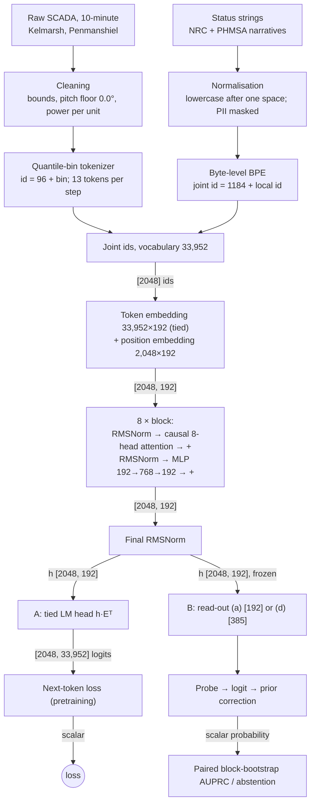

> **EXAM STUDY GUIDE — not the project README. Canonical record: README.md, docs/DECISIONS.md.**
> Written against commit `9fc78eb`; §0.5 and the ADR-0029 material against `0468f1f`. Where this guide and the record differ, the record is right.

# FaultLine: exam study guide

## §0 How to use this guide

- Read §1 and the pitch first. Say the pitch aloud until it takes a minute.
- Every pipeline step in §3 has four parts: **What**, **Why this choice**, **Worked example**, **If challenged**. The "If challenged" part is the answer to the hardest follow-up question.
- §5 holds the results. Quote verdict words exactly as written there: SUPPORTED, INCONCLUSIVE, NOT EVALUABLE, PASS, FAIL.
- §7 is a question bank. §8 is the one page to read in the corridor.
- Every number has a source in the Appendix (§9): file, line and field.
- Three phrasings are agreed. Use them word for word:
  - "calibrated abstention implemented and evaluated; graceful degradation not established"
  - "scores are rankings, not risks, without recent recalibration"
  - the CPU stream demo is "an end-to-end pipeline through to a CPU inference demo". Never say "deployed".
- Two more rules since ADR-0029 (§0.5):
  - H1′ is always said in one breath: "SUPPORTED on the registered label; INCONCLUSIVE under the ADR-0009 anemometer-excluded variant (ADR-0029, exploratory)". Never call H1′ "robust".
  - Every persistence score is said with its lookback: P1 looks back 24 h, the same as the model; P2 looks back up to 720 h. "Does not beat persistence" cites P1 as the like-for-like comparison and P2 as the strongest.

## §0.5 What changed on 2026-09-27 (ADR-0029)

Two checks were added after the programme closed. Both are **exploratory**: no verdict is re-decided, and every registered verdict word in this guide stands as written.

**1. The anemometer check.** ADR-0009 required every late-test result to be reported twice: with and without the fault events that the message `anemometer defect` opens, because they look like a reporting change. That was never done for H1, H1′, ADR-0027 or ADR-0028. ADR-0029 did it on the saved scores. Without those events the test base rate falls from 0.0388 to 0.0243. Most results hold. These do not:

- H1′ is SUPPORTED on the registered label; INCONCLUSIVE under the ADR-0009 anemometer-excluded variant (ADR-0029, exploratory). Seed 2's gain falls to +0.0031 [−0.0076, +0.0116].
- The status-string counter moves from level with joint (d) to above it on all three seeds.
- The `joint_no_txt` gate would FAIL (5 of 9) instead of PASS.
- The calibration under-read shrinks from about half to about a tenth to a fifth.

**2. The persistence check.** Nobody had compared the model with the simplest rule: a turbine that just had a fault will have another.

- **P1** asks whether a fault started in the last 24 h, the model's own window. This is the like-for-like comparison. P1 beats joint (d) on the registered label and is level with it under the variant.
- **P2** is minus the hours since the last fault start, looking back up to 720 h. This is the strongest. It beats joint (d) on both labels: 0.2211 against 0.0685–0.0810, and 0.0944 against 0.0514–0.0632.

**The new headline:** the model does not beat time since the last fault. A fault started in the preceding 24 h for 31.29% of test positives and 2.71% of negatives. Much of the task is recurrence.

### The 60-second pitch

> FaultLine is a controlled study of what a small transformer, built from scratch, learns from
> wind-turbine telemetry and operator text. Ten-minute SCADA data from two UK wind farms, status
> messages and US federal incident narratives share one vocabulary of 33,952 ids. I pretrained a
> 10.45M-parameter decoder on 50,003,968 tokens per arm on one 8 GB GPU, and a frozen probe reads
> the risk of a fault in the next 24 hours. Every test was registered before it ran, with a control
> that could falsify it. The headline: the model does not beat time since the last fault. Like for
> like, a rule asking whether a fault started in the same 24 hours matches or beats it. The hours
> since the last fault, looking back up to 720 hours, beats it on every seed. Pretraining is
> visible, nine pairs of nine. The text-aware result, H1′, is SUPPORTED on the registered label;
> INCONCLUSIVE under the ADR-0009 anemometer-excluded variant (ADR-0029, exploratory). So this is a
> careful measurement, not a working fault predictor.

---

## §1 Goal

**Plain.** Can a small language model trained on wind-turbine sensor data, with or without operator text, warn that a fault is coming in the next day? And does that warning still work at a different site, on a different make of turbine, or later in time?

**Precise.**

- **The question** (README.md): does pretraining a small decoder-only transformer over quantised SCADA telemetry, alone or jointly with operator text, produce a representation from which a one-hidden-layer probe (RMSNorm → Linear(w→192) → GELU → Linear(192→1)) on the frozen backbone can read the risk of a fault event in the next 24 hours? And does that reading survive a change of site, of manufacturer, or of time?
- **"A fault event in the next 24 hours"** is the label `narrow_within_24h`. It asks: does a technical-cause stop start in the next 144 ten-minute steps?
- **The pre-registered hypotheses.**
  - **H1** (ADR-0025): "the text pathway carries signal the telemetry tokens do not". Tested as the joint arm against `tel_only`, with the same seed, the same windows and a paired Δ AUPRC. The smallest effect of interest is 0.005.
  - **H1′** (ADR-0026): the same hypothesis re-tested with a changed instrument, the text-aware read-out (d). It was registered after H1's result was known, and the record says so. Outcome: SUPPORTED on the registered label; INCONCLUSIVE under the ADR-0009 anemometer-excluded variant (ADR-0029, exploratory).
  - **H2** (ADR-0028): "As degradation severity rises, coverage falls and selective risk stays approximately flat … if coverage stays flat while selective risk rises, H2 is refuted."
  - **Site shift.** This is **not a numbered hypothesis**. It was tested as pre-registered gates: ADR-0021 (Hill of Towie, a held-out site) and ADR-0022 (CARE, held-out farms from other manufacturers).
  - H3 (cross-OEM transfer of status semantics, ADR-0007) was **withdrawn** at its own testability gate: 0 of 693 Hill of Towie narrow events and 0 of 45 CARE anomalies map to a status-string type. H3′ (ADR-0017) is a text-side claim about the surface form of status strings.
- **The one-GPU constraint.** Everything ran on one NVIDIA GeForce RTX 4060 with 8 GB. That fixed the model size (S2), the budget (50,003,968 tokens per arm) and the seeds (3).
- **Forward-in-time design.** Training uses 2016–2020, validation uses 2021, and the test uses 2022 onward. The model is always tested on a period after the one it learned from.

---

## §2 Data

| source | what it is | role | years & split | licence | processing |
|---|---|---|---|---|---|
| **Kelmarsh** | Cubico wind farm, UK. 6 × Senvion MM92, rated 2,050 kW. 10-minute SCADA and a status log. | train / val / test | Published 2016–2024. Train 2016–2020, val 2021, test 2022–2024. | CC BY 4.0 | Cleaning with plausibility bounds; pitch floored at 0.0° (ADR-0012); power as per-unit of rated (ADR-0013); status strings normalised (H3′, ADR-0017); md5 checksums per file |
| **Penmanshiel** | Cubico, UK. 14 × Senvion MM82, rated 2,050 kW. Turbine WT03 is absent from the record. | train / val / test | Train 2016–2020, val 2021, test **2022 only** | CC BY 4.0 | As Kelmarsh |
| **Hill of Towie** | RES on behalf of TRIG, UK. 21 × Siemens SWT-2.3-VS-82, rated 2,300 kW. Publishes alarm codes, not strings, and its described codes are all non-technical. | held-out site, test only | 2019 and 2023 staged; every row is test | CC BY 4.0 | Same cleaning; power per-unit of 2,300 kW |
| **CARE** | Fraunhofer IEE. 36 turbines in 3 anonymised farms: A is 5 onshore turbines in Portugal, B and C are offshore in Germany. 95 datasets, 45 of them with labelled anomaly events. Timestamps are anonymised. | evaluation only | every row is test | CC BY-SA 4.0 | Same canonical schema; kept out of training by its licence (ADR-0004) |
| **NRC** | US Nuclear Regulatory Commission: 5 collections (Event Notification Reports, Information Notices, Bulletins, Generic Letters, Regulatory Issue Summaries). | text pretraining | own train / val / test split, loss reported per source | public domain (17 U.S.C. 105) | clean → filter → exact and near dedup → PII policy; sha256 per document |
| **PHMSA** | US pipeline incident narratives, 2010 onward. 10,033 staged; 9,659 after the pipeline. | text pretraining | as NRC | public domain (17 U.S.C. 105) | as NRC |

**Processing, in plain words.**

- **Plausibility bounds.** A value outside a physical range becomes missing. Examples: wind speed 0.0–40.0 m/s; pitch −5.0–100.0°.
- **Pitch floor (ADR-0012).** A uniform floor at 0.0° at every site. It is applied after the bound, so a pitch below −5 is missing, not floored.
- **Power per unit (ADR-0013).** Power is stored as P / P_rated, and the channel is renamed `power_kw` → `power_pu`. The two Cubico farms and Hill of Towie then sit on one scale.
- **Status normalisation (H3′, ADR-0017).** Each status string is re-encoded lowercase after one leading space, `" " + s.lower()`. The tokenizer is not refitted.
- **Checksums.** Telemetry manifests record the provider's md5, recomputed locally. Text documents are pinned by sha256.
- **PII policy for narratives (ADR-0005).** Emails are masked to `<EMAIL>` and phone numbers to `<PHONE>`. Digit runs are **not** masked, because quantities are the technical content.

**Why a forward-in-time split.** Splits are never random. The point is performance in a later period than the one the model trained on. A random split would put 2023 minutes next to their 2023 neighbours in training, and consecutive ten-minute steps are nearly identical. The record is honest about the limit: ADR-0009 calls the late split "a temporal hold-out with a change in what is labelled, not a drift test". ADR-0022 calls it in-distribution, not shift. Penmanshiel's test is 2022 only because its 2023–2024 exports are tier 2 and were never staged.

**Why Hill of Towie and CARE are held out.** Hill of Towie has a different manufacturer (Siemens, not Senvion), a different control system and a documented mid-record retrofit. It is the closest thing to a new deployment. CARE is held out for a licence reason, not a modelling one (ADR-0004): it is share-alike, so it stays out of the training corpus entirely.

**Why US federal text.** No public wind source pairs telemetry with free text (ADR-0001). Public SCADA status logs are template strings, not language. US federal works carry no domestic copyright (17 U.S.C. 105), so NRC and PHMSA narratives are a legal source of operational incident language.

**Base rates, and why AUPRC must be read against them.**

| split | base rate | counts |
|---|---|---|
| test (Kelmarsh + Penmanshiel, stride 12) | **0.0388** | 5,312 of 137,025 windows |
| train, natural rate | **0.0221** (recorded to full precision as 0.022050022218159642) | measured by the sampler |
| validation 2021 | **0.0211** | 1,805 of 85,529 |
| Hill of Towie | 0.03325 | |
| CARE | 0.001254 | 540 of 430,506 windows |

A classifier that guesses at random scores an AUPRC equal to the base rate. So an AUPRC of 0.058 on the test split must be read against 0.0388, not against zero. The test base rate is 1.8× the training rate: the event rate rose after 2021. This is a recorded temporal shift, and it matters again for calibration (§5).

---

## §3 Pipeline

### 3.1 Telemetry tokenizer

**What.**

- There are 14 canonical channels. 12 are **core**, meaning present at both training sites and mappable at the held-out site. The 2 extended ones are `wind_direction_deg` (0% of Hill of Towie's 2019 grid) and `gearbox_bearing_temp_c` (absent at both Cubico sites).
- Each core channel is quantised to **256 bins**, fitted on the **train split only**.
- The v2 fit is the one in force (`configs/tokenizer/quantile_bins_v2.yaml`). It builds bins in this order:
  1. **Point masses first.** A value holding at least 1/256 of a channel's training values gets an exact bin of its own, up to 16 per channel. Example: pitch at exactly 0.0°.
  2. **Fixed-width tail bins.** Each tail, below the training p0.5 and above p99.5, gets `n_tail` = **4** bins of equal width.
  3. **Clamp floor (ADR-0015).** The outermost tail bin is merged inward until it holds at least 0.1% of the channel's training values.
  4. **Quantile bins** fill the centre with whatever is left of the 256.
- A missing value becomes `<nan>` (id 9). A value beyond the training range clamps to the first or last bin.
- **One step is 13 tokens:** `<sep>` (id 8), then one bin token per core channel in a fixed order. The channel is identified by position.
- One 24 h window = 144 steps = **1,872 tokens**.

> ⚠ The brief, and README.md before its 2026-09-26 fix, said "16 fixed-width bins per tail". That was the v1 fit. The v2
> tokenizer in force uses `n_tail: 4` (quantile_bins_v2.yaml). The pre-registered signal fired at
> 16: 184 of 352 tail bins held under 500 training values, and 42 held none.

#### How (channel, bin) becomes an id: 1,024 ids for 12 × 256 = 3,072 combinations

This is the exact mechanism, from the code.

1. **Each channel gets its own edges.** `transform_channel` bins a value with that channel's own edges: `np.searchsorted(interior, array, side="right")`, then clips to `[0, bins_in_use − 1]` (`src/faultline/tokenizers/quantile_bins.py:616-619`). The result is a **local bin index b in 0..255**. The channel is not part of b.
2. **One shared offset for every channel.** `encode_steps` computes `ids = self.layout.bin_offset + binned` (`src/faultline/tokenizers/joint.py:203`), where `BIN_OFFSET = CHANNEL_OFFSET + CHANNEL_CAPACITY` = 32 + 64 = **96** (`src/faultline/tokenizers/layout.py:85-86`). So:

   > **id = 96 + b**, whatever the channel.

3. **So 12 × 256 = 3,072 (channel, bin) pairs collapse onto 256 ids, [96, 352).** Bin 109 of generator speed and bin 109 of main-bearing temperature are the **same id, 205**. The worked example below contains exactly this case.
4. **The channel comes back from position.** Each step is written as `<sep>` followed by the 12 core channels in fitted order (`joint.py:207-209`). The k-th token after `<sep>` is always channel k. The shard manifest records the order as `"step": ["<sep>", "wind_speed_ms", "power_pu", …]`. The decoder uses learned absolute positions because "`position mod 13` names the channel" (`src/faultline/model/transformer.py:9-12`). Inside a 2,048-token window, `<sep>` marks the phase of each step.
5. **Why the block has 1,024 slots when 256 are used.** `BIN_CAPACITY = 1024` is headroom, so a finer binning never moves the blocks after it (`layout.py:63-65`; the "64 are configured today" comment there dates from an earlier fit). Ids [352, 1120) are reserved and never emitted. The decoder docstring confirms: "The vocabulary is 1,184 identifiers of which 258 occur" (`transformer.py:15-16`). That is 256 bins + `<sep>` + `<nan>`.
6. **The rejected alternative** was N_channels × N_bins distinct ids. It is recorded in ADR-0003 and kept open for later (`layout.py:21-25`). At 256 bins it would need 3,072 ids, which does not fit a 1,024-slot block.

#### Why channel tokens [32, 96) exist but are not emitted

- The channel block holds 64 slots, and 14 channels are defined. A channel token's id is 32 + the channel's canonical index (`joint.py:166`, `layout.py:294-303`).
- Only `encode_telemetry` emits them, in the form `<tel> (channel, bin) (channel, bin) … </tel>` (`joint.py:140-176`).
- The fixed-order stream the model trains on, `encode_steps`, emits **none**: "No channel token is written: position identifies the channel, and the channel block stays reserved for the variable-set ablation over extended channels (ADR-0003)" (`src/faultline/data/telemetry/shards.py:11-12`; also `joint.py:10-19`).
- Why reserve them? If a step ever carries a varying set of channels (extended channels at some sites only), position can no longer say which is which. Then the channel token is needed.
- Why not emit them anyway? With a fixed set, position already says which channel it is. A channel token would add 12 tokens to every step, all of them fully predictable, and the model would spend context and loss on them.

**Why this choice.**

- **Quantiles, not fixed widths.** Power and temperatures are heavily skewed. Fixed widths would spend most of the vocabulary on values that occur a few times a year (`quantile_bins.py:4-6`).
- **Fixed-width tails.** Faults live where data is sparse. At 256 pure quantile bins the top bin of generator bearing temperature spanned 42.7 °C (`quantile_bins.py:25-27`).
- **Train-only fit.** Fitting on the whole record leaks the held-out period's distribution into the vocabulary (`quantile_bins.py:10-12`).
- **`<nan>`, not imputation.** Missingness is itself a signal (ADR-0006).

**Worked example: one real step.** Kelmarsh 4, 2023-01-01 23:50 UTC. This is the first window end in the committed stream trace (`reports/data/stream_trace_kelmarsh_4_2023.csv`, `window_end_step` 523622). The values come from the final table `data/final/telemetry/kelmarsh/Kelmarsh_4__2023.parquet`, which is local and not committed; these are post-cleaning values, so power is already per-unit. The bins come from the committed tokenizer `data/tokenizers/quantile_bins_v2_9cd52b65.json`. The 13 ids match the committed shard `kelmarsh__test.bin` at tokens [523622 × 13, +13) byte for byte.

| pos | channel | value | local bin b | bin edges [lo, hi) | id = 96 + b |
|---|---|---|---|---|---|
| 0 | `<sep>` | — | — | — | **8** |
| 1 | wind_speed_ms | 5.0243 | 86 | [5.0019, 5.0322) | **182** |
| 2 | power_pu | 0.1670 | 121 | [0.1659, 0.1687) | **217** |
| 3 | rotor_speed_rpm | 10.2961 | 66 | [10.2645, 10.3767) | **162** |
| 4 | generator_speed_rpm | 1219.5687 | 109 | [1216.9000, 1221.5867) | **205** |
| 5 | pitch_angle_deg | 0.0 | 0 | point-mass bin for exactly 0.0 | **96** |
| 6 | nacelle_position_deg | 182.8543 | 88 | [182.3885, 183.4218) | **184** |
| 7 | ambient_temp_c | 6.9700 | 70 | [6.9300, 7.0000) | **166** |
| 8 | nacelle_temp_c | 19.1325 | 119 | [19.0800, 19.1400) | **215** |
| 9 | gearbox_oil_temp_c | 56.5325 | 166 | [56.5150, 56.5483) | **262** |
| 10 | generator_bearing_temp_c | 38.2725 | 97 | [38.2383, 38.3000) | **193** |
| 11 | generator_winding_temp_c | 58.4725 | 46 | [58.4550, 58.5100) | **142** |
| 12 | main_bearing_temp_c | 26.4575 | 109 | [26.4467, 26.4900) | **205** |

The step on disk is `[8, 182, 217, 162, 205, 96, 184, 166, 215, 262, 193, 142, 205]`. Positions 4 and 12 both carry id 205. Only their position says one is generator speed and the other is main-bearing temperature.

**If challenged.**

- *"Doesn't sharing bin ids across channels confuse the model?"* The embedding of 205 is shared, so the model must combine it with position. Learned absolute positions make that easy: position mod 13 is the channel. The record kept the per-channel alternative open (ADR-0003) in case channel conditioning proved too weak.
- *"Did the quantile bins cause the site-shift failure?"* That is the author's interpretation of the CARE attribution, not a registered finding: bins fitted on one OEM's distribution do not carry to another's. The registered clause is narrower: "the null is a property of the token stream across OEMs". Farm A is attributed to transfer failure; farms B and C are unattributed.

### 3.2 Text tokenizer

**What.**

- Byte-level BPE, written in this repository (`src/faultline/tokenizers/text_bpe.py`). It uses a GPT-2-style pre-tokenizer. The `tokenizers` library is a test-only reference.
- **Vocabulary 32,768 = 256 byte tokens + 32,512 merges.**
- Trained on the train split of the NRC and PHMSA corpus: 31,750 documents, 10,012,124 tokens (`<sep>` excluded). The text shards hold **10,043,874** train tokens (`<sep>` included). The difference is 31,750, one `<sep>` per document.

> ⚠ The brief, and README.md before its 2026-09-26 fix, said "32,768 merges". The record says 32,768 is the **vocabulary size**
> and 32,512 merges were learned (reports/data/text_bpe_v1_20260915.md; text_bpe.py:23-25).

**Why this choice.**

- Byte-level means no unknown characters, ever.
- Writing it in-repo was part of the brief: every component from scratch.
- 32,768 fills the text block exactly, [1184, 33952), so the joint vocabulary needs no renumbering.

**Worked example: one real status string.** "Automatic start-up" is a Kelmarsh/Penmanshiel status message. It is in the code book as `msg_0009` and in `configs/data/events_v2.yaml`. Kelmarsh 4 logged it on 2023-01-04 at 14:06:57 UTC. Encoded with the committed tokenizer `data/tokenizers/text_bpe_v1_22c56e49.json`:

| convention | string | BPE pieces | local ids | joint ids (+1184) |
|---|---|---|---|---|
| raw (provider casing) | `Automatic start-up` | `Automatic` · ` start` · `-` · `up` | 16293, 1271, 45, 536 | 17477, 2455, 1229, 1720 |
| **normalised (H3′, in force)** | ` automatic start-up` | ` automatic` · ` start` · `-` · `up` | **2404, 1271, 45, 536** | **3588, 2455, 1229, 1720** |

In the `tel+status` stream, the message follows the 13 tokens of its step, wrapped as `<txt>` (id 4) … `</txt>` (id 5). A message is attached to the first step at or after its start, with the start rounded **up** to the ten-minute grid. So no window sees a message before its label stops counting it (`src/faultline/data/joint/mixture_shards.py:14-20`).

Normalisation turns the string-initial piece `Automatic` (a rare piece, id 16293) into ` automatic`, the form prose uses (id 2404). Across all 264 strings, the count with every token frequent in training rose from 18 to 80. The pre-registered line was 50, so surface convention was CONFIRMED as the dominant barrier (ADR-0017).

**If challenged.** *"Why pretrain on nuclear and pipeline text for wind turbines?"* It is the only large, legal, public source of operational incident language, and there is no paired wind text. The record tested whether it helps: ADR-0027's `joint_no_txt` (no narrative corpus) is INCONCLUSIVE, and its gate PASSED on the registered label; under the ADR-0009 anemometer-excluded variant that gate would FAIL, 5 of 9 (ADR-0029, exploratory). So the question stays open, and nothing is claimed.

### 3.3 Joint vocabulary (ADR-0003 v2): 33,952 ids

| block | ids | capacity | in use |
|---|---|---|---|
| specials | [0, 32) | 32 | 11 defined: `<pad>` 0, `<bos>` 1, `<eos>` 2, `<unk>` 3, `<txt>` 4, `</txt>` 5, `<tel>` 6, `</tel>` 7, `<sep>` 8, `<nan>` 9, `<mask>` 10 |
| channel | [32, 96) | 64 | 14 defined, **none emitted** in the fixed-order stream |
| bin | [96, 1120) | 1,024 | 256 (ids 96–351) |
| time | [1120, 1184) | 64 | reserved |
| text | [1184, 33952) | 32,768 | all 32,768 |

**What.** One id space for both modalities. The offsets are derived from the fixed capacities, never from counts in use (`layout.py:9-14`).

**Why one shared vocabulary.**

- One decoder reads both modalities, so both must live in one id space, one embedding table and one softmax.
- Fixed capacities mean a telemetry shard tokenized at M1 is still byte-identical at M3. The telemetry blocks are a stable prefix of 1,184 ids.
- Text comes last because it is the only block allowed to grow.
- 33,952 fits `uint16` (below 65,536), so shards stay memory-mappable at 2 bytes per token (`shards.py:81-83`).

**Worked example.** The joint id of the BPE piece ` automatic` is 1184 + 2404 = 3588. The telemetry bin 109 is 96 + 109 = 205.

**If challenged.** *"Why reserve slots you never use?"* Changing any capacity after M1 invalidates every checkpoint and every shard. The unused slots cost embedding rows, and the record accepts that cost.

### 3.4 Embedding

**What.**

- A token table of 33,952 × 192 = 6,518,784 parameters. It is **tied** to the output head: logits = h · Eᵀ (`transformer.py:395`).
- A learned absolute position table of 2,048 × 192 = 393,216 parameters.
- The input to block 1 is the token embedding plus the position embedding (`transformer.py:348`).

**Why this choice.**

- **Tying.** One matrix both reads tokens in and scores them out. An untied head would add another 6,518,784 parameters, more than the whole S2 backbone. The record's reason: "an untied head would spend more parameters on the vocabulary than some rungs of the ladder spend on the whole backbone" (`transformer.py:15-17`).
- **Learned absolute positions, not rotary.** In the fixed-order stream, absolute phase carries the schema: position mod 13 is the channel. Rotary encodes relative offset, which is the right prior for language and the wrong one for a rigid frame (`transformer.py:9-14`).
- **2,048 context when a window is 1,872.** The ladder's own context is 144 × 13 = 1,872 tokens: one 24 h telemetry window. Every M3 run trains and probes at 2,048 (`configs/train/joint_v1.yaml`). The 176-token difference is room for status text in the `tail_anchored_2048` probe window. That window ends at the last token of step t, messages included. It holds the stream back to step t − 143 at most, and whole leading steps are dropped until at most 2,048 tokens remain, so it starts at a `<sep>`. It is right-padded with `<pad>` (`src/faultline/training/joint_windows.py:24-30`). Pure telemetry fills 2,048 in 157.5 steps.

**Worked example.** The `[2048]` id window becomes `[2048, 192]` after the token and position look-ups.

**If challenged.** *"`tel_only` never emits a text id. Isn't the 33,952-row table wasted?"* Yes. About 6.5M of its parameters are embedding rows it never uses. That is deliberate: every arm shares one architecture, so an arm difference cannot be an architecture difference. The record states it (`docs/COURSE_PORT.md:172`).

### 3.5 Transformer S2

**What.** A decoder-only causal transformer, written from scratch (`src/faultline/model/transformer.py`).

- 8 layers, d_model 192, 8 heads, head dimension 24.
- MLP 4× (192 → 768 → 192), GELU, **no biases anywhere** in the backbone.
- RMSNorm in pre-norm position, plus a final RMSNorm.
- Dropout 0.0.
- Two attention paths, fused and explicit, which a test asserts agree.
- **3,542,208 backbone / 10,454,208 total parameters.**

**The parameter arithmetic, on paper** (d = 192, L = 8):

| piece | formula | count |
|---|---|---|
| attention q, k, v | 192 × 576 (3 × 192) | 110,592 |
| attention output proj | 192 × 192 | 36,864 |
| → attention per block | 4d² | 147,456 |
| MLP up | 192 × 768 | 147,456 |
| MLP down | 768 × 192 | 147,456 |
| → MLP per block | 8d² | 294,912 |
| two RMSNorm weight vectors | 2 × 192 | 384 |
| **one block** | 12d² + 2d | **442,752** |
| 8 blocks | 8 × 442,752 | 3,542,016 |
| final RMSNorm | 192 | 192 |
| **backbone** | 12Ld² + 2Ld + d | **3,542,208** |
| token embedding (tied, counted once) | 33,952 × 192 | 6,518,784 |
| position embedding | 2,048 × 192 | 393,216 |
| **total** | | **10,454,208** |

The ladder's "nominal" count 12Ld² = 3,538,944. The 3,264 gap is exactly the RMSNorm weights: 17 vectors × 192.

**Why S2, from the ladder S0–S3** (`configs/model/ladder_v0.yaml`):

| rung | d_model | layers | heads | backbone params | seeds |
|---|---|---|---|---|---|
| S0 | 80 | 4 | 5 | 307,920 | 1, 2, 3 |
| S1 | 128 | 6 | 8 | 1,181,312 | 1, 2, 3 |
| **S2** | **192** | **8** | **8** | **3,542,208** | 1 |
| S3 | 288 | 10 | 12 | 9,959,328 | 1 |

ADR-0018's resource ruling: "all three arms at S2 only. The rung is fixed for comparability, not performance. Every arm runs at one rung, so an arm difference cannot be a rung difference." For scale: one 50M-token S2 arm's pretraining took 0.15 GPU-hours (ADR-0018).

**Worked example.** Shapes through one block: `[2048, 192]` → RMSNorm → q, k, v each `[8 heads, 2048, 24]` → causal attention → `[2048, 192]` → + residual → RMSNorm → MLP `[2048, 768]` → `[2048, 192]` → + residual.

**If challenged.**

- *"Why dropout 0?"* The record states the value (`ladder_v0.yaml:43`) but gives **no written rationale**. The defensible argument is yours, not the record's: 50M was chosen as "the largest round budget under which no stream repeats". So each token is seen about once, repetition-driven overfitting is not the risk, and the models are undertrained, not overfitted.
- *"Why no biases?"* The record states the fact, not a reason. Your argument: in a pre-norm stack the biases add little, and without them the count is exact. The measured count equals 12Ld² plus the RMSNorm weights, with nothing else.
- *"Why not S3?"* The recorded reason is comparability: every arm at one rung. Your supporting argument: the comparison needs matched arms and three seeds on one 8 GB card, and S3 is larger and slower.

### 3.6 Pretraining

**What.**

- Next-token cross-entropy over every position. `<nan>` is predicted like any token (`transformer.py:397-414`).
- **50,003,968 tokens per arm** = 763 steps × 32 windows × 2,048 tokens. Each step is a batch of 4 windows × 8 accumulation steps.
- AdamW, peak learning rate 6e-4, linear warmup over 2% of steps, then cosine decay to 0.1 × peak. Weight decay 0.1, β = (0.9, 0.95), gradient clip 1.0, bf16.
- **Arm mixture.** `tel_only` is `tel` 1.0. **`joint`** is **`tel` 0.30 · `txt` 0.20 · `tel+status` 0.50**. `joint_no_txt` is `tel` 0.50 · `tel+status` 0.50.
- **Initial-loss guard.** At initialisation, a decoder with std 0.02 weights and a tied head predicts almost uniformly, so its first loss is about ln V = ln 33,952 = 10.4327. The run refuses to start unless the first batch loss is in [ln V − 0.50, ln V + 0.10] = [9.9327, 10.5327] (`src/faultline/training/loop.py:37-45, 64-66`). Every recorded S2 first step lies in 10.4175..10.4639.
  - Above the band, the logits are not near zero: a scale or tying defect.
  - Below the band, the model "predicts before it has learned": a leak, a shifted target, or a smaller vocabulary than declared.
- **Causal-mask check.** A test changes one token and asserts nothing before it moves. Positions {0, 1, 517, 2046}, batch 3, on the fused, explicit and trainable-tail paths, 12 cases, atol 1e-6 (`tests/model/test_real_spec.py`; `docs/INSTRUMENT_AUDIT.md` entry 13).

**Why this choice.**

- **Matched budget.** "`tel_only` is the equal-token control: a joint arm that beats M1 by seeing more tokens is not evidence for the joint design." Every arm sees exactly 50,003,968 tokens. GPU-hours are observed, never the budget.
- **Tokens per parameter, stated honestly.** The measured ratios over the 61.6M-token telemetry training stream are 5.9 over all parameters and 17.4 over the backbone. The ~20 tokens-per-parameter heuristic comes from natural language, and the record never adopted it. Each arm's 50,003,968 tokens is below 61.6M, so its ratio is lower still. The budget was set by matching arms on one GPU, not by a compute-optimal rule. The models are undertrained, and the record says so.

**Worked example.** The first batch of an S2 run should print a loss near ln V = 10.4327. A first loss below 9.9327 stops the run before any token is wasted: the model would be predicting before it has learned.

**If challenged.** *"Why 50M and not more?"* It is the largest round budget under which no stream repeats: the text stream holds 10,043,874 train tokens, and `txt` at 0.20 of 50M is 0.996 passes. More tokens would repeat text and change what the arms compare.

### 3.7 From backbone to risk

**What.**

- The backbone is **frozen** (`requires_grad_(False)`, `src/faultline/model/risk.py:227-229`).
- A small head reads one vector per window and outputs one logit.
- **Read-out (a) `final_position`:** the final hidden state h_L, width 192.
- **Read-out (d) `last_plus_text`:** the concatenation [h_L; mean of h over text-token positions; has-text flag]. Its width is 2 × 192 + 1 = **385**. A text-token position is `<txt>` (4), `</txt>` (5) or any id ≥ 1,184. With no text, the mean is a zero vector.
- **The head, exactly.** The record calls it a "linear head", loosely. In code it is **one hidden layer**: RMSNorm(width) → Linear(width → 192) → GELU → Linear(192 → 1), with biases (`risk.py:137-142, 165`). ADR-0026 §2 says "a **linear head** — the head in force, one hidden layer". Know both words.
- **Balanced sampling.** Probe batches are 50% positive (`positive_fraction: 0.5`). The probe sees 16,000 positives over 1,000 steps: batch 16 × accumulate 2, learning rate 0.002, 32,000 windows.
- **ADR-0019 prior correction.** Training at 50% positives shifts the logit. The correction is z_true = z_train + logit(π_true) − logit(π_train). With π_train = 0.5 and π_true = 0.0221, the offset is −3.79 nats (the stream trace applies −3.7921).
- **Fixed final-step selection (ADR-0022 addendum):** "Every probe in every arm, from this record onward, is read at its last probe step. No validation-split checkpoint selection is performed."

**Why this choice.**

- **Frozen**, so the test measures what **pretraining** put in the representation. A trainable backbone, or a deep head, could learn the task from scratch and answer a different question (`risk.py:21-24`).
- **Balanced sampling, then correction.** At a 2% base rate, an unbalanced batch of 16 holds almost no positives. Balancing gives the head a signal, and the correction restores a probability at the natural rate.
- **Fixed final step.** The validation split, with 117 positives, cannot rank probe checkpoints: the untrained head sat inside every selection interval. Choosing the last step removes a free parameter.

**Worked example.** A raw probe logit of 0.0 means "50/50 under balanced training". The correction adds logit(0.0221) − logit(0.5) = −3.79, so the corrected probability is exactly the natural rate, 0.0221.

**If challenged.** *"Why did the final-position read-out miss the text?"* Under the `tail_anchored_2048` window, the last real position is always a telemetry bin token. The status messages sit at earlier steps. A final-position probe must hope the model carried the text forward into that one vector. Read-out (d) gives the head a direct path to the text positions. This is the project's methodological finding (§6).

### 3.8 Evaluation

**What.**

- **AUPRC** = average precision, the step-wise sum that scikit-learn calls `average_precision_score`, never the trapezoid. It is implemented in-house with ties grouped (`src/faultline/evaluation/metrics.py`).
- **Two-day block bootstrap.** Blocks of 288 steps (48 h, twice the label horizon), 10,000 replicates, seed 20260916, 95% percentile interval.
- **1% discard rule.** A replicate with no positive window is discarded and counted. If more than 1% are discarded, the interval is untrusted, and the comparison fails or is NOT EVALUABLE.
- **Paired bootstrap for every comparison.** Both models are scored on the identical resampled set, and the interval is on the difference.
- **Controls.**
  - **Random-init backbone:** the same constructor, no optimiser step, the same probe.
  - **Order-blind bag-of-tokens:** logistic regression, one linear layer 1,184 → 1 with a bias, on token counts divided by 144 steps.
  - **Status-only classifier (control ii):** the same regression over the 33,952 ids, with only text ids and `<txt>`/`</txt>` kept.
- **Smallest effect of interest: 0.005 AUPRC. Seeds 1, 2, 3.**

**Why this choice.**

- **AUPRC, not accuracy or ROC.** At a base rate of 0.0388, "never a fault" is right about 96% of the time, so accuracy rewards doing nothing. ROC AUC is dominated by the huge negative class. AUPRC measures how clean the top of the ranking is, and its chance level is the base rate.
- **Block bootstrap.** Consecutive ten-minute windows overlap and are autocorrelated. Resampling single windows would treat near-copies as independent and give intervals that are too narrow.
- **Paired.** ADR-0023 first required the trained model's interval to lie entirely above the random-init model's interval. That is "the overlapping-confidence-intervals fallacy": two independent 95% intervals not overlapping is a far stricter test than 5%. It "could not have passed at any of the four designs". ADR-0024 replaced it with the paired test, and the original FAILs stay on the record.
- **Random-init control.** In the README's words, "a probe that cannot separate trained from random cannot measure anything about pretraining".

**Worked example.** Pretrained seed 1 against random-init seed 1: paired Δ = +0.0124 [+0.0084, +0.0175]. The lower bound is above zero, so pretraining helped, on the same resampled blocks.

**If challenged.** *"Why 0.005?"* Seed-to-seed variance on the forward-in-time split equals one seed's interval half-width. About 0.005 AUPRC is the smallest difference this evaluation can resolve, and every claim is sized to that.

### 3.9 Abstention (ADR-0028)

**What.**

- **Ensemble:** p = mean over the 3 seeds of sigmoid(z_s), with z_s the prior-corrected logit.
- **Confidence = seed disagreement:** u = std_s(z_s), the population standard deviation (ddof 0). A lower u means more confidence.
- **Operating point, fixed on 2021 validation before any test number:**
  - τ = the threshold on p that maximises F1 on validation.
  - κ = the 0.90 quantile of validation u, giving 90% coverage.
  - **Decision:** abstain when u > κ; otherwise alarm when p ≥ τ.
  - For joint (d): τ = 0.0637, κ = 0.3388.
- **Selective risk** = misclassifications among covered windows ÷ covered windows.
- **Calibration:** ECE over 15 **equal-mass** bins. Platt recalibration (a, b on logit(p)) fitted on validation.
- **Severity ladder:** mask k of the 12 core channels to `<nan>` on every step, text kept, for k = 2, 4, 6, 8. The channel sets are nested and drawn with seed 20260924.
- **Gates.**
  - **Gate A:** does disagreement order risk better than a random ordering (Δ AURC)?
  - **Gate B:** does k = 8 damage the ranking? If not, H2 is NOT TESTABLE.
  - **H2 rule:** SUPPORTED if the upper bound of Δcov < 0 AND the upper bound of Δrisk < +0.005.

**Why this choice.** Seed disagreement needs no extra model, and three seeds already exist. Fixing τ and κ on validation keeps the test honest. The ladder exists because dropping one to three channels cost at most 0.0085 AUPRC, too mild to test H2.

**Worked example.** At k = 8, coverage falls 0.0797 but selective risk rises +0.0053 [+0.0033, +0.0074]. The upper bound 0.0074 is not below 0.005, so it is not SUPPORTED. The lower bound of Δcov is below zero, so it is not REFUTED either. That leaves INCONCLUSIVE.

**If challenged.** *"ECE improves as you mask more channels. Isn't that good?"* No. Masking raises the mean probability from 0.0216 toward the base rate. It does not calibrate.

### 3.10 CPU stream demo (`src/faultline/deployment/stream.py`)

**What.** An end-to-end pipeline through to a CPU inference demo: backbone, frozen probe, prior-corrected probability, one window after another in time order, over one real turbine-year. It writes a CSV, an SVG and a report under `reports/data/`. Kelmarsh 4, 2023: 8,562 windows at stride 6, 6.5 windows/s on CPU.

**What it does not claim.** "This is a demonstration, not an evaluation. It registers no rule, decides nothing and adds no number to the record." It has no threshold, no alarm mark and no abstention band. Two turbine-years were chosen by two rules declared before any score was seen, and "two examples are not a sample".

**Why this choice.** It shows the pipeline runs causally, window by window, on CPU. That is the streaming argument for the final-position read-out.

**If challenged.** *"So is it deployed?"* No. Nothing in this repository is a deployed system. The record puts the ONNX export and the CPU demo out of scope for claims. The trace is a demonstration only.

---

## §4 Architecture diagram


The same flow, with the shape at each arrow:



---

## §5 Results

Registered verdicts are unchanged. Where ADR-0029 reports what a rule would return under the ADR-0009 anemometer-excluded variant (test base rate 0.0243, 3,330 of 137,016 windows), the row says so, and those numbers are **exploratory**. The ADR-0029 rows at the foot of the table are exploratory too.

| gate / test | hypothesis | result with 95% CI | verdict | ADR | report file |
|---|---|---|---|---|---|
| Hill of Towie held-out site (seed 1) | site shift | 0.0393 [0.0306, 0.0553] vs base rate 0.03325 | **NOT EVALUABLE** | 0021 | `reports/data/gate_check_v0_20260916.md` |
| Hill of Towie, three seeds | site shift | 0.0390, 0.0510, 0.0359; 1 of 3 seeds clears | **NOT EVALUABLE** | 0022 §6 | `reports/data/seed_replication_v0_20260917.md` |
| CARE, three seeds | site shift | 0.0013 [0.0009, 0.0019], 0.0012 [0.0009, 0.0016], 0.0012 [0.0008, 0.0017] vs 0.001254 | **NOT EVALUABLE** (0 of 3) | 0022 | `reports/data/axis_gate_v0_20260918.md` |
| random-init probe control, non-overlap | probe can see pretraining | §a: trained lower bound 0.0434 not above random-init upper bound 0.0500 | **FAIL** | 0023 | `reports/data/probe_control_v0_20260916.md` |
| pretrained vs random-init, paired, 3 × 3 | probe can see pretraining | Δ +0.009 to +0.019; 9 of 9 lower bounds > 0 | **PASS** | 0024 | `reports/data/seed_replication_v0_20260917.md` |
| probe vs bag-of-tokens, 3 seeds | — (reported) | +0.0016 [−0.0059, +0.0084], +0.0053 [−0.0017, +0.0128], −0.0015 [−0.0094, +0.0053] | parity (no gate) | 0024 | `reports/data/seed_replication_v0_20260917.md` |
| joint vs `tel_only`, read-out (a) | H1 | +0.0022 [−0.0034, +0.0068], −0.0022 [−0.0084, +0.0021], −0.0018 [−0.0060, +0.0021]; median −0.0018 | **INCONCLUSIVE** | 0025 | `reports/data/h1_gate_v0_20260919.md` |
| (d) trained vs random-init gate | instrument | 9 of 9 lower bounds > 0, weakest +0.0058; variant: 9 of 9, weakest +0.0012 | **PASS** (variant: PASS) | 0026 | `reports/data/readout_v0_20260920.md` |
| joint (d) vs `tel_only` (a) | H1′ | +0.0200 [+0.0112, +0.0294], +0.0234 [+0.0128, +0.0342], +0.0170 [+0.0111, +0.0232]; median +0.0200. Variant: +0.0140 [+0.0026, +0.0264], +0.0031 [−0.0076, +0.0116], +0.0137 [+0.0077, +0.0201] | **SUPPORTED** on the registered label; **INCONCLUSIVE** under the ADR-0009 anemometer-excluded variant (ADR-0029, exploratory) | 0026, 0029 | `reports/data/readout_v0_20260920.md`; `reports/data/exploratory_v0_20260926.md` |
| joint (d) vs status-only classifier | — (reported) | +0.0055 [−0.0173, +0.0241], +0.0085 [−0.0141, +0.0265], −0.0040 [−0.0264, +0.0125]. Variant: −0.0187 [−0.0534, +0.0093], −0.0305 [−0.0635, −0.0058], −0.0299 [−0.0641, −0.0050] | parity on the registered label; under the variant the classifier reads above joint (d) on all three seeds, excluding zero on seeds 2 and 3 (ADR-0029, exploratory) | 0026, 0029 | `reports/data/readout_v0_20260920.md`; `reports/data/exploratory_v0_20260926.md` |
| `joint_no_txt` | narrative corpus matters | gate PASS 9 of 9; median −0.0030. Variant: gate 5 of 9, weakest −0.0020 | **INCONCLUSIVE**; gate PASS on the registered label, FAIL under the ADR-0009 anemometer-excluded variant, which would make the arm NOT EVALUABLE (ADR-0029, exploratory) | 0027, 0029 | `reports/data/ablation_gate_v0_20260923.md`; `reports/data/exploratory_v0_20260926.md` |
| `joint_status_raw` | H3′ normalisation matters | gate FAIL 4 of 9; median −0.0037 | **NOT EVALUABLE** | 0027 | `reports/data/ablation_gate_v0_20260923.md` |
| Gate A, uncertainty informative | — | joint (d) Δ AURC −0.0275 [−0.0302, −0.0250]; PASS on all three arms | **PASS** | 0028 | `reports/data/abstention_v0_20260924.md` |
| Gate B, damage at k = 8 | — | Δ AUPRC −0.0039 [−0.0082, −0.0001] | **DAMAGE, narrowly** | 0028 | `reports/data/abstention_v0_20260924.md` |
| graceful degradation, k = 8 | H2 | Δcov −0.0797 [−0.0841, −0.0753]; Δrisk +0.0053 [+0.0033, +0.0074]. Variant: Δrisk +0.0044 [+0.0024, +0.0064] | **INCONCLUSIVE** (variant: same) | 0028 | `reports/data/abstention_v0_20260924.md` |
| calibration, joint (d) ensemble | — (reported) | mean p 0.0216 against 0.0388; ECE 0.0172, 0.0164 after Platt. Variant: mean p 0.0216 against 0.0243; ECE 0.0047, 0.0048 after Platt | under-read about half on the registered label; about a tenth to a fifth under the ADR-0009 anemometer-excluded variant (ADR-0029, exploratory) | 0028, 0029 | `reports/data/abstention_v0_20260924.md`; `reports/data/exploratory_v0_20260926.md` |
| P1 persistence: an event started in (t − 24 h, t]; 24 h lookback, the same as the model | — (exploratory) | 0.1262 [0.1024, 0.1528]; P1 − joint (d) +0.0451 to +0.0577 per seed. Variant: 0.0625 [0.0463, 0.0821]; every P1 − joint (d) interval spans zero | like-for-like: beats joint (d) on the registered label; level under the variant | 0029 | `reports/data/exploratory_v0_20260926.md` |
| P2 persistence: −hours since the last event start; lookback up to 720 h | — (exploratory) | 0.2211 [0.1862, 0.2582]; P2 − joint (d) +0.1400 to +0.1526. Variant: 0.0944 [0.0735, 0.1189]; P2 − joint (d) +0.0312 to +0.0430, every interval above zero | strongest: beats joint (d) on both labels | 0029 | `reports/data/exploratory_v0_20260926.md` |

### The story, in order

0. **The headline, from ADR-0029 (exploratory): the model does not beat time since the last fault.**
   - **Like for like, P1** (24 h lookback, the same as the model): 0.1262 against joint (d)'s 0.0685–0.0810 on the registered label, every paired interval above zero. Under the variant P1 reads 0.0625 and every interval against joint (d) spans zero: level.
   - **Strongest, P2** (lookback up to 720 h): 0.2211 on the registered label, 0.0944 under the variant. It beats joint (d) on every seed under both labels, and the three-seed ensemble by +0.1418 [+0.1103, +0.1746] and +0.0371 [+0.0178, +0.0580].
   - **Why.** A narrow event started in the preceding 24 h for 31.29% of test positives and 2.71% of negatives (variant: 26.46% and 3.25%). Much of the task is recurrence.
   - **What the model's input loses.** P3 reads the training fault-opening codes from the raw status log over (t − 24 h, t]; P4 reads them only from the model's own window. P3 − P4 is +0.0004 [−0.0009, +0.0019]. The pipeline loses almost nothing: 173 windows lose the flag, all to the 2,048-token cap.
1. **Site shift: two pre-registered negatives.**
   - **Hill of Towie.** The rule needs the block-bootstrap lower bound above the site's base rate, 0.03325. Seed 1 scored 0.0393 [0.0306, 0.0553]: NOT EVALUABLE. Over three seeds only one clears (1 of 3), so it is still NOT EVALUABLE. The site is "marginal, not null".
   - **CARE.** It sits at chance on every seed: 0.0012–0.0013 against a base rate of 0.001254, over 430,506 windows holding all 45 labelled events. "CARE is at chance, not merely wide."
   - **Attribution (ADR-0022 F6-0).** Imposing each CARE farm's missing-channel pattern on the training-site test split leaves the probe above base rate on 3 of 3 seeds (F6-0a); no registered clause attributes any farm's null to the channel gaps. The order-blind comparator is also at chance on CARE: 0.001940 [0.001233, 0.003830]. The registered clause: "the null is a property of the token stream across OEMs". Per farm, A is a transfer failure and B and C are unattributed. The author's interpretation, not a registered finding: quantile bins fitted on one manufacturer's distribution do not carry to another's.
   - **Consequence:** the only evaluable axis is forward-in-time at the training sites. No result below is a site-shift result.
2. **Pretraining is visible to the probe.** Pretrained vs random-init, paired, 3 pretraining seeds × 3 init seeds: **9 of 9** lower bounds above zero, Δ **+0.009 to +0.019**. That is a quarter to a half of the base rate. Untrained backbones already read 0.039–0.042; trained ones read 0.051–0.058.
3. **Telemetry-only is at parity with a bag of tokens.** All three paired intervals span zero, and the sign flips across seeds. On this stream, at this size and budget, order does not measurably help.
4. **H1 is INCONCLUSIVE, then H1′ is SUPPORTED on the registered label; INCONCLUSIVE under the ADR-0009 anemometer-excluded variant (ADR-0029, exploratory).**
   - H1's read-out was the last position, which is always a telemetry token. The decomposition shows why the result was flat: the joint window costs the `tel_only` backbone −0.0122, −0.0096 and −0.0076, and joint pretraining recovers +0.0144, +0.0075 and +0.0059. The two cancel.
   - H1′ used the same frozen backbones with the text-aware read-out (d). The gate PASSED 9 of 9, weakest +0.0058. H1′ is SUPPORTED on the registered label with a median of **+0.0200**, four times the smallest effect of interest.
   - Level check: joint (d) scores 0.0780, 0.0810 and 0.0685, against `tel_only` (a) at 0.0580, 0.0576 and 0.0515.
   - **Under the variant (ADR-0029, exploratory)** the rule would return INCONCLUSIVE. Seed 2 fails: +0.0031 [−0.0076, +0.0116]. Its joint (d) loses 0.0296 AUPRC to the variant, while `tel_only` (a) seed 2 loses 0.0093. The median falls from +0.0200 to +0.0137. The instrument gate still passes, weakest +0.0012.
5. **Parity with counting strings.** The status-only order-blind classifier scores **0.0725 [0.0537, 0.0979]**. That is its **AUPRC**, not a Δ. On the registered label the paired Δ of joint (d) against it spans zero on all three seeds. "A linear read of the SLM's text-position states matches a histogram of the strings; it does not beat it." Under the variant (ADR-0029, exploratory) the classifier rises to 0.0819 [0.0538, 0.1200], lift 3.37. It is the only read whose AUPRC rises. It reads above joint (d) on all three seeds, and the intervals exclude zero on seeds 2 and 3.
6. **F8 / ADR-0027: neither sentence decided.**
   - `joint_no_txt` passed its gate and is INCONCLUSIVE (median −0.0030). Under the variant (ADR-0029, exploratory) the gate would FAIL, 5 of 9, which would make the arm NOT EVALUABLE.
   - `joint_status_raw` failed its gate (4 of 9) and is NOT EVALUABLE. On raw-cased windows, untrained backbones already read 0.0665, 0.0653 and 0.0651, so the instrument cannot separate pretraining from the tokens.
7. **F9 / ADR-0028: calibrated abstention implemented and evaluated; graceful degradation not established.**
   - Gate A PASSED on all three arms. Gate B found narrow damage. H2 is INCONCLUSIVE.
   - **Calibration.** The mean predicted probability is 0.019–0.022 against a base rate of 0.0388. That is an under-read by about half (DECISIONS.md), or "about 2×" (README.md), both before and after Platt. For joint (d), ECE went 0.0172 → 0.0164 with Platt.
   - Part of the cause is the post-2021 rise in event rate, which Platt fitted at the validation base rate of 0.0211 cannot remove. The record also finds an in-time component, a property of the probe: two of three `tel_only` seeds under-read on 2021 validation (0.0185 and 0.0183 against 0.0211). So the scores are rankings, not risks, without recent recalibration.
   - **Under the variant (ADR-0029, exploratory)** the mean probability does not move, but the base rate falls to 0.0243. The under-read becomes about a tenth to a fifth, and ECE falls from 0.016–0.019 to 0.004–0.005 on every arm, before and after Platt. Much of the "about half" is the label change. The agreed phrase still holds.

---

## §6 Honest assessment

### (a) What did not work, and the most likely reason for each

| what | most likely reason (as the record states it) |
|---|---|
| Joint (d) does not beat persistence (ADR-0029, exploratory) | Much of the task is recurrence: a fault started in the preceding 24 h for 31.29% of test positives and 2.71% of negatives. Like for like, P1 (24 h lookback, the same as the model) beats joint (d) on the registered label and is level under the variant. The strongest, P2 (lookback up to 720 h), beats it on both. No event-history comparator was ever registered, so no gate could have caught this. |
| H1′ does not hold under the variant (ADR-0029, exploratory) | H1′ is SUPPORTED on the registered label; INCONCLUSIVE under the ADR-0009 anemometer-excluded variant (ADR-0029, exploratory). The failure is one seed: seed 2's joint (d) loses 0.0296 AUPRC without the anemometer-defect events, and its Δ falls to +0.0031 [−0.0076, +0.0116]. The ADR-0009 with/without obligation was not executed for H1′ until ADR-0029. |
| Hill of Towie: NOT EVALUABLE | Different OEM and control system. The site is marginal, not null: one seed of three clears. |
| CARE: at chance | The token stream does not transfer across OEMs: quantile bins fitted on one OEM's distribution. The channel gaps were ruled out. |
| Telemetry model ≈ bag of tokens | At 50M tokens and S2, pretraining learns token statistics a histogram already captures. Order adds nothing measurable. |
| H1 INCONCLUSIVE | The instrument, not the model: the last-position read-out lands on a telemetry token and does not reach the text. |
| Joint (d) ≈ status-only classifier: parity on the registered label; under the variant the classifier reads above joint (d) on all three seeds, excluding zero on seeds 2 and 3 (ADR-0029, exploratory) | The signal is in *which strings occur*. Part of it is "Stop" rows: removing all of them (R2) cuts the counter's lift over the telemetry bag from +0.0202 to +0.0074. P3, a training fault-opening code in the raw log over the preceding 24 h, reads 0.1256 against P1's 0.1262, so the string signal looks largely like recurrence (ADR-0029, exploratory). A counter captures the signal as well as the model does. |
| `joint_status_raw` NOT EVALUABLE | Under raw casing, untrained backbones already read the strings, so the gate cannot separate pretraining. |
| H2 INCONCLUSIVE | Δrisk +0.0053 straddles the 0.005 line. Abstention gives up coverage, but it cannot be shown to hold selective risk. |
| Probabilities under-read about 2× on test: about half on the registered label; about a tenth to a fifth under the ADR-0009 anemometer-excluded variant (ADR-0029, exploratory) | Partly the post-2021 rise in event rate, which a correction fitted on earlier data cannot remove; two of three seeds also under-read in-time, a property of the probe. Under the variant the mean probability does not move while the base rate falls to 0.0243, so much of the gap goes with the anemometer-defect events. |
| First probe-control criterion FAIL (ADR-0023) | A mis-specified rule (non-overlap). It was replaced by the paired test, and the original FAILs stay on record. |

### (b) Why it is still strong

- **Pre-registration with outcomes recorded even when negative.** Eight gates, ADR-0021 → ADR-0028. Each rule was committed before its run, with the registering hash beside the outcome.
- **Controls that could have falsified every claim:** random-init backbone, order-blind bag-of-tokens, status-only classifier, and a random-init gate for each new read-out.
- **Paired statistics.** Every model-vs-model comparison uses a paired two-day block bootstrap.
- **An instrument audit with 15 entries.** Each is a case where the instrument or a premise was the defect, not the model, with its counterfactual.
- **The methodological finding.** The read-out decides whether text information is visible. The same frozen backbone reads INCONCLUSIVE through (a); through (d), H1′ is SUPPORTED on the registered label; INCONCLUSIVE under the ADR-0009 anemometer-excluded variant (ADR-0029, exploratory).
- **The record checked itself, and reports the reversal.** The ADR-0009 with/without obligation and a persistence baseline were both added late, in ADR-0029, registered before any P-score AUPRC or variant-label metric was computed, apart from one disclosed spot check (flag prevalences had been seen, and are disclosed too). Together they turned around the only positive result, and the write-up leads with that.
- **A full from-scratch stack on 8 GB:** data pipeline, both tokenizers, the transformer, the training loop and the evaluation harness.

**The frame:** *a controlled study of what a from-scratch telemetry–text model learns, which does not beat time since the last fault*, not *a working fault predictor*.

---

## §7 Likely exam questions

**Q1. Why quantile bins?**
The channels are heavily skewed, so fixed-width bins would waste most tokens on rare values. Quantile bins spend resolution where the data is dense. The fixed-width tails (4 per side in v2) and the clamp floor keep resolution in the sparse tails where faults live. Edges are fitted on the train split only, so the vocabulary does not leak the test period.

**Q2. Why no channel tokens?**
Every step has the same 12 channels in the same order, so position already names the channel. Channel tokens would add 12 fully predictable tokens per step. The channel block [32, 96) stays reserved for a variable-set ablation over extended channels, where position cannot identify the channel. `encode_telemetry` still produces that format.

**Q3. How does (channel, bin) map into [96, 1120)?**
id = 96 + b, where b is the local bin from that channel's own edges. The channel does not enter the id. So 12 × 256 pairs share 256 ids, [96, 352), and ids [352, 1120) are reserved headroom. The channel is recovered from the token's position after `<sep>` (`joint.py:203`, `layout.py:85-86`).

**Q4. Why tied embeddings?**
The token table is 33,952 × 192 = 6,518,784 parameters. An untied head would add the same again, more than the whole backbone. Tying also makes the scoring of a token consistent with how it is read in. The record's reason is parameter economy against a mostly-unused vocabulary.

**Q5. Why dropout 0?**
The record gives only the value, not a reason. Answer honestly: the 50M budget was chosen so that no stream repeats, so each token is seen about once. The models are undertrained, not overfitted, and regularising an undertrained model slows it further.

**Q6. Why S2?**
ADR-0018 fixed all arms at S2 "for comparability, not performance". An arm difference then cannot be a rung difference. For scale, one S2 arm's 50M-token pretraining took 0.15 GPU-hours on the RTX 4060. That the budget allowed three seeds of every arm is your argument, not a recorded reason.

**Q7. Why 50M tokens?**
It is the largest round budget under which no stream repeats: text at 0.20 of 50M is 0.996 passes of its 10,043,874 train tokens. It is matched across arms, so the joint arm cannot win by seeing more tokens. The actual figure is 50,003,968, rounded up to 763 whole optimiser steps.

**Q8. 1,872 vs 2,048?**
1,872 = 144 × 13 is one 24 h telemetry window, the ladder's context. 2,048 is the M3 context. The 176-token difference is room for status text in the `tail_anchored_2048` window. When text overflows, whole leading steps are dropped so the window still starts at `<sep>`.

**Q9. Why a frozen probe?**
The question is what pretraining put in the representation. A trainable backbone or a deep head could learn the task on its own and would answer a different question. The random-init control only means something if the backbone is frozen in both arms.

**Q10. Is the probe really linear?**
The record calls it a "linear head". In code it is one hidden layer: RMSNorm → Linear(width → 192) → GELU → Linear(192 → 1). The record says so itself: "a linear head — the head in force, one hidden layer". It is shallow on purpose: "one hidden layer is the most that can be called a probe".

**Q11. Why AUPRC, not accuracy or ROC?**
At a base rate of 0.0388, predicting "no fault" always is about 96% accurate, so accuracy rewards doing nothing. ROC AUC is dominated by the huge negative class and looks good even when the top of the ranking is noisy. AUPRC's chance level is the base rate, so every AUPRC must be read against it.

**Q12. Why a block bootstrap?**
Consecutive ten-minute windows overlap and are strongly autocorrelated. Resampling single windows treats near-copies as independent and makes intervals too narrow. Two-day blocks (288 steps, twice the horizon) keep dependent windows together. 10,000 replicates, seed 20260916.

**Q13. Why paired?**
Both models are scored on the same test windows, so their errors are correlated. Comparing two independent intervals ignores that and is far too strict: the overlapping-intervals fallacy. ADR-0023's non-overlap rule "could not have passed", so ADR-0024 replaced it with a paired bootstrap on the difference, and the original FAILs stay on the record.

**Q14. Why a random-init control?**
It tells you whether the probe can see pretraining at all. The same head on an untrained backbone gives the floor that architecture and tokens alone provide. Untrained backbones already read 0.039–0.042, and through read-out (d) as much as 0.0581. Without this control those levels would have been credited to pretraining.

**Q15. Why the fixed final step?**
The 2021 validation split has 117 positives and cannot rank probe checkpoints: the untrained head sat inside every selection interval. Selecting on it would add noise and a free parameter. So every probe is read at its last step, by a registered rule (ADR-0022 addendum).

**Q16. Why doesn't the model beat a bag of tokens or counting strings, and is it still worth it?**
On telemetry, at this size and budget, order adds nothing measurable. The text signal is mostly *which* status strings occur (removing "Stop" rows halves it), and a counter captures that. It is still worth it: the joint representation encodes the text beyond what the tokens alone supply (the random-init gate passed 9 of 9), and the study shows exactly where the ceiling is. Beating the counter is the next research question, not a claim. Two ADR-0029 facts (exploratory) sharpen this. Under the ADR-0009 anemometer-excluded variant the counter reads above joint (d) on all three seeds, excluding zero on seeds 2 and 3. And neither the model nor the counter beats P2 (lookback up to 720 h).

**Q17. Why did site shift fail?**
At Hill of Towie the result is marginal: 1 of 3 seeds clears its base rate. At CARE it is at chance. The channel-gap explanation was tested and ruled out, and a bag-of-tokens is also at chance on CARE, so the failure sits in the token stream across OEMs. The indicated fix is per-site or rank-based bin fitting, untried here.

**Q18. What would you do next?**
Three CPU analyses first, each registered before it runs, against a named sentence:
1. **The incremental value of (d) over P2.** Fit a combination of P2 and the (d) score on 2021 validation, then ask on test whether it beats P2 alone. This is the direct test of whether the model adds anything to time since the last fault.
2. **Continuation-excluded windows.** Drop the windows in which a fault episode is already under way at t, for example those with a narrow event start in the preceding 24 h (31.29% of test positives, 2.71% of negatives). Then re-score the model and every P score on the rest. This separates predicting a new fault from recognising a continuing one.
3. **The Penmanshiel 2023–2024 confirmatory set.** No run has read it. Stage it under rules registered before staging, and score the frozen checkpoints on it. It answers the test-reuse problem: every registration so far read one test split.

After those: per-site or rank-based bin fitting for cross-OEM transfer; recalibration on recent data; and a design that must beat P2 and the status-string counter, not just match the counter.

**Q19. What does "pre-registered" mean here?**
The rule — metric, split, bootstrap, smallest effect, and the SUPPORTED / REFUTED / INCONCLUSIVE clauses — was written into `docs/DECISIONS.md` and committed in its own commit before the run. The outcome was written under it with the registering hash. Nothing was re-worded after the numbers existed. When a rule proved mis-specified, the old verdict stayed and a new rule was registered under a new number.

**Q20. What does "H2 INCONCLUSIVE" mean?**
At k = 8 masked channels, coverage fell (Δcov −0.0797, upper bound below zero), which is what H2 wants. But selective risk rose +0.0053 [+0.0033, +0.0074], and the upper bound is not below the 0.005 line. So SUPPORTED fails, REFUTED fails, and the registered rule says INCONCLUSIVE. In plain words: abstention gives up coverage, but we cannot show it holds risk flat.

**Q21. How would you deploy it honestly?**
As a ranking aid for maintenance attention, never as a probability of failure, because the scores are rankings, not risks, without recent recalibration. You would recalibrate on recent data, monitor the base rate, and keep abstention with a validation-fixed operating point. What exists today is an end-to-end pipeline through to a CPU inference demo, not a deployed system.

**Q22. Why was the H1′ test fair, if it came after H1 failed?**
It was registered as a separate hypothesis with a changed instrument, before its run, and the record says it was registered after H1's result was known. It carried its own random-init gate, so a read-out that merely read token embeddings would have failed. H1's INCONCLUSIVE stays on the record as the verdict for the last-position instrument. Say the outcome in full: SUPPORTED on the registered label; INCONCLUSIVE under the ADR-0009 anemometer-excluded variant (ADR-0029, exploratory). Fair in procedure is not the same as holding up: the variant check, which ADR-0009 required from the start, was not run for H1′ until ADR-0029.

**Q23. Why no persistence baseline?**
None was registered. Every registered comparator was built from the model's own tokens: random-init backbones, the order-blind bag of tokens and the status-only classifier. None of them reads the event history directly. The gap surfaced after the programme closed, when a reconnaissance found a fault-opening `Stop` row in 30.74% of test positives and 2.63% of negatives. ADR-0029 then added four persistence scores, exploratory, on the same windows with the same estimator. The honest answer: it should have been registered from the start. Had it been, H1′ and the parity framing would have been judged against P1 and P2 from the beginning.

**Q24. Is P2 fair?**
As a baseline an operator could run, yes. P2 uses only event starts at or before t, which the event log already holds, and it is scored on the same windows with the same paired bootstrap. As a like-for-like comparison, no. P2 looks back up to 720 h, thirty times the model's 24 h window. That is why the like-for-like comparison is **P1**, which looks back 24 h, the same as the model. P1 beats joint (d) on the registered label (+0.0451 to +0.0577 per seed) and is level with it under the variant (every interval spans zero). **P2** is the strongest, and it beats joint (d) on both labels. Two measured caveats:
- P1 and P2 read every narrow event, anemometer-defect events included, so under the variant they use inputs the label no longer counts.
- An event starting exactly at t might rest on steps after t for its 60-second qualification. That affects 25 windows (12 positive). Without them P1 reads 0.1253, against 0.1262.

**Q25. What is the anemometer issue?**
The test base rate is 1.8× the training rate. ADR-0009 traced the rise to one status message, `anemometer defect`. From 2021, the year the status export gained two columns, it opens more than one narrow event per turbine-year at both sites. The record reads that as a reporting or firmware change, not a change in how often turbines fail. So ADR-0009 required every late-test result to be reported with and without those events. The requirement was honoured for the axis gate (ADR-0022 §3) and nowhere after it. ADR-0029 closed the gap on the saved scores, as an exploratory record. Without those events the test holds 137,016 windows, 3,330 of them positive, a base rate of 0.0243. Nine windows drop out, all on 2022-12-31 at Penmanshiel 06 and 14, because their horizon runs past the end of the record.
- **What moves:** H1′, the parity result, the `joint_no_txt` gate and the calibration reading.
- **What does not:** H1, the ADR-0026 random-init gate, the `joint_status_raw` gate and verdict, Gate A, Gate B and H2.

**Q26. Does the text help or not?**
Answer in three layers.
- **Registered.** Through the last-position read-out, H1 is INCONCLUSIVE. Through the text-aware read-out, H1′ is SUPPORTED on the registered label; INCONCLUSIVE under the ADR-0009 anemometer-excluded variant (ADR-0029, exploratory).
- **Against a counter.** On the registered label joint (d) is at parity with the status-only classifier. Under the variant the classifier reads above joint (d) on all three seeds, and the intervals exclude zero on seeds 2 and 3 (ADR-0029, exploratory).
- **Against persistence.** P3 reads a training fault-opening code from the raw status log over the preceding 24 h, and scores 0.1256. P1, a text-free check for an event start in the same 24 h, scores 0.1262. So the strings' signal looks largely like recurrence, and the event log carries as much.

So the status text carries risk signal, but on this evidence it is mostly "a fault just happened", and the model extracts no more of it than a counter or the event log. Whether the narrative corpus helps is undecided. `joint_no_txt` is INCONCLUSIVE, with its gate PASSED 9 of 9 on the registered label. Under the ADR-0009 anemometer-excluded variant the gate would FAIL, 5 of 9, and the arm would be NOT EVALUABLE (ADR-0029, exploratory).

**Q27. Is the model calibrated?**
No. On the registered label (ADR-0028), the mean predicted probability is 0.019–0.022 against a base rate of 0.0388, an under-read by about half. Platt fitted on validation does not fix it. For joint (d), ECE is 0.0172, and 0.0164 after Platt. Under the ADR-0009 anemometer-excluded variant (ADR-0029, exploratory), the mean probability does not move but the base rate falls to 0.0243. The under-read becomes about a tenth to a fifth, and ECE falls to 0.004–0.005 on every arm. So much of the "about half" goes with the label change, not the probe. The agreed phrase stands: scores are rankings, not risks, without recent recalibration. One trap to avoid: ECE also falls as channels are masked, only because the mean probability rises toward the base rate.

---

## §8 One-page cheat sheet

```
DATA      Kelmarsh 6×MM92, Penmanshiel 14×MM82 (2,050 kW) | HoT 21×Siemens (2,300 kW) | CARE 36, 3 farms
SPLIT     train 2016–2020 · val 2021 · test 2022+ (Penmanshiel 2022 only)
BASE      test 0.0388 (5,312 of 137,025) · train 0.0221 · val 0.0211 · HoT 0.03325 · CARE 0.001254
LABEL     narrow_within_24h = technical stop starts in next 144 steps (24 h)
CHANNELS  14 canonical, 12 core; 256 bins each; tails n_tail 4 (v2); clamp floor 0.1%
STEP      <sep>(8) + 12 bins = 13 tokens; <nan> = 9; bin id = 96 + b; 144 steps = 1,872
BINS      12 × 256 = 3,072 pairs → 256 ids [96, 352); [352, 1120) reserved; 258 ids occur
CHANNEL   tokens [32, 96): 64 slots, 14 defined, NONE emitted (position = channel)
BPE       vocab 32,768 = 256 bytes + 32,512 merges; +1184 offset; 10,043,874 train tokens
VOCAB     33,952: specials [0, 32) chan [32, 96) bin [96, 1120) time [1120, 1184) text [1184, 33952)
S2        8 layers · d 192 · 8 heads (24) · MLP 768 GELU · RMSNorm pre-norm · dropout 0 · no bias
PARAMS    backbone 3,542,208 = 8×442,752 + 192 · total 10,454,208 (+6,518,784 tok +393,216 pos)
CONTEXT   2,048 (M3) vs 1,872 (one window); 176 tokens of text room
PRETRAIN  50,003,968 tok/arm = 763 × 32 × 2,048 · AdamW 6e-4 cosine · wd 0.1 · bf16
MIXTURE   joint = tel 0.30 · txt 0.20 · tel+status 0.50
GUARD     first loss in [ln V − 0.50, ln V + 0.10] = [9.9327, 10.5327]; ln V = 10.4327
PROBE     frozen · 1 hidden layer (record: "linear head") · (a) 192 · (d) 385 · balanced 0.5
PRIOR     z + logit(0.0221) − logit(0.5) → offset −3.79 nats (ADR-0019)
EVAL      AUPRC · 2-day blocks (288) · 10,000 reps · seed 20260916 · discard >1% · PAIRED
SESOI     0.005 AUPRC · seeds 1, 2, 3
HoT       0.0393 [0.0306, 0.0553] vs 0.03325 → NOT EVALUABLE; 3 seeds: 1 of 3
CARE      0.0012–0.0013 vs 0.001254 → NOT EVALUABLE (at chance); token stream across OEMs
PRE>RAND  9/9, Δ +0.009 to +0.019 (ADR-0024 PASS)
BAG       tel-only ≈ bag-of-tokens: +0.0016, +0.0053, −0.0015 (all span 0)
H1        +0.0022, −0.0022, −0.0018; median −0.0018 → INCONCLUSIVE (ADR-0025)
HEADLINE  the model does not beat time since the last fault (ADR-0029, exploratory)
P1        24 h lookback = the model's (like-for-like): 0.1262 full, beats (d) +0.0451..+0.0577;
          0.0625 variant, level with (d) (every interval spans 0)
P2        lookback up to 720 h (strongest): 0.2211 full, 0.0944 variant; beats (d) on both labels
RECUR     event start in prior 24 h: positives 31.29% vs negatives 2.71% (variant 26.46% vs 3.25%)
P3 − P4   +0.0004 [−0.0009, +0.0019]: model's window loses ~nothing (173 windows, all token cap)
VARIANT   ADR-0009 anemometer-excluded: 3,330 of 137,016, base 0.0243 (9 windows NA)
H1′       +0.0200, +0.0234, +0.0170; median +0.0200; gate 9/9 → SUPPORTED on the registered
          label; INCONCLUSIVE under the ADR-0009 anemometer-excluded variant (ADR-0029,
          exploratory): seed 2 +0.0031 [−0.0076, +0.0116]. Never "robust".
STATUS    status-only AUPRC 0.0725 [0.0537, 0.0979]; joint (d) vs it → parity on the registered
          label; variant: counter 0.0819, above (d) on all 3 seeds, excl. 0 on seeds 2, 3
ADR-0027  no_txt INCONCLUSIVE (−0.0030), gate PASS 9/9 registered · FAIL 5/9 under the variant
          (ADR-0029, exploratory) · status_raw NOT EVALUABLE (gate 4/9)
ADR-0028  Gate A PASS ×3 · Gate B −0.0039 · H2 INCONCLUSIVE: Δcov −0.0797, Δrisk +0.0053
CALIB     mean p 0.019–0.022 vs 0.0388 (≈2× under-read, registered) · variant vs 0.0243: a tenth
          to a fifth, ECE 0.004–0.005 (ADR-0029, exploratory) · rankings, not risks
NEXT      (d) over P2 fitted on validation · continuation-excluded windows · Penmanshiel 2023–24
AUDIT     15 instrument-audit entries
GPU       RTX 4060 8 GB · floor 18.2 GPU-h over the programme
SAY       "calibrated abstention implemented and evaluated; graceful degradation not established"
SAY       "scores are rankings, not risks, without recent recalibration"
SAY       "an end-to-end pipeline through to a CPU inference demo" — never "deployed"
SAY       H1′: "SUPPORTED on the registered label; INCONCLUSIVE under the ADR-0009
          anemometer-excluded variant (ADR-0029, exploratory)"
SAY       persistence: P1 = 24 h (like-for-like), P2 = up to 720 h (strongest)
```

---

## §9 Appendix: provenance table

Every number in this guide is in this table: the number, the file, the line, and the field.
Kinds of source:

- **file:line**: a committed file. A script checked that the number is printed on that line, or on one of the next two where the source wraps.
- **derived**: arithmetic on recorded inputs. The formula is given, and the script evaluated it.
- **local artefact**: the worked example's raw values and shard bytes. They come from files under `data/` that are not committed; the tokenizers are committed. They were re-computed by encoding the row with the committed tokenizer and comparing with the shard.
- **brief**: a format parameter of the task, not a result.
- **JSON path** (ADR-0029 rows): a field of `reports/data/exploratory_v0_20260926.json`, written as a dotted path with 0-based list positions. The stated number is that field rounded to the digits shown. These numbers are exploratory.

| number(s) | file | line | field |
|---|---|---|---|
| 60 | `task brief` | — | 60-second spoken pitch (format asked for by the brief) |
| 4060, 8 GB | `src/faultline/model/design.py` | 58 | GPU |
| 18.2 | `README.md` | 15 | GPU-hours floor over the programme |
| 24 | `README.md` | 5 | risk horizon, hours |
| 144 | `configs/eval/axis_gate_v0.yaml` | 21 | H = 144 steps, label narrow_within_24h |
| 0.005 | `docs/DECISIONS.md` | 4725 | smallest effect of interest (H1 rule) |
| 2016, 2020, 2021, 2022 | `configs/data/splits_v3.yaml` | 49 | split years |
| 2024 | `README.md` | 46 | Kelmarsh test end year; Penmanshiel test 2022 |
| 3 | `configs/eval/h1_gate_v0.yaml` | 42 | three seeds (1, 2, 3) |
| 1, 2 | `configs/eval/h1_gate_v0.yaml` | 42 | seed ids |
| 6 | `data/cards/kelmarsh.md` | 25 | Kelmarsh turbines |
| 2,050 | `data/cards/kelmarsh.md` | 26 | rated power kW |
| 2016-2024 | `data/cards/kelmarsh.md` | 27 | published period |
| 14 | `data/cards/penmanshiel.md` | 25 | Penmanshiel turbines |
| 21 | `data/cards/hill_of_towie.md` | 25 | Hill of Towie turbines |
| 2,300 | `data/cards/hill_of_towie.md` | 26 | Hill of Towie rated power |
| 2019, 2023 | `configs/data/sources_telemetry.yaml` | 172 | HoT staged years |
| 36 | `data/cards/care.md` | 25 | CARE turbines |
| 5, 95, 45 | `data/cards/care.md` | 31 | CARE farms, datasets, events |
| 4.0 | `docs/DATA_LICENSES.md` | 15 | licence version (CC BY 4.0 / CC BY-SA 4.0) |
| 17, 105 | `docs/DATA_LICENSES.md` | 26 | public domain statute |
| 2010 | `docs/DATA_LICENSES.md` | 39 | PHMSA narratives from 2010 |
| 10,033 | `data/cards/phmsa_incident_narratives.md` | 23 | PHMSA staged documents |
| 9,659 | `data/cards/phmsa_incident_narratives.md` | 44 | PHMSA after pipeline |
| 0.0, 40.0 | `configs/data/telemetry_v4.yaml` | 73 | wind speed bounds |
| 5.0, 100.0 | `configs/data/telemetry_v4.yaml` | 84 | pitch bounds |
| 0.0 | `docs/DECISIONS.md` | 1387 | ADR-0012 pitch floor |
| -5 | `configs/data/telemetry_v4.yaml` | 10 | floor after bound |
| 0.0388, 5,312, 137,025 | `docs/DECISIONS.md` | 3160 | test base rate |
| 0.0221 | `docs/DECISIONS.md` | 2722 | train natural rate |
| 0.022050022218159642 | `reports/data/gate_check_v0_20260916.json` | 130 | natural_rate |
| 0.0211, 1,805, 85,529 | `docs/DECISIONS.md` | 5714-5716 | val base rate |
| 0.03325 | `README.md` | 62 | HoT base rate |
| 0.001254 | `docs/DECISIONS.md` | 3106 | CARE base rate |
| 540, 430,506 | `docs/DECISIONS.md` | 3180 | CARE scored windows |
| 1.8 | `README.md` | 46 | test / train rate |
| 0.058 | `README.md` | 72 | trained tel-only AUPRC range (upper) |
| 14, 12, 2 | `data/cards/care.md` | 98-100 | 14 canonical, 12 core, 2 extended |
| 0% | `src/faultline/data/telemetry/schemas.py` | 96 | wind_direction at HoT 2019 |
| 256 | `configs/tokenizer/quantile_bins_v2.yaml` | 83 | bins per channel |
| 16 | `configs/tokenizer/quantile_bins_v2.yaml` | 94 | max point masses |
| 1/n_bins | `configs/tokenizer/quantile_bins_v2.yaml` | 92 | point-mass threshold (1/256) |
| 4 | `configs/tokenizer/quantile_bins_v2.yaml` | 114 | tail bins per side (v2) |
| 0.005 | `configs/tokenizer/quantile_bins_v2.yaml` | 115 | tail boundary p0.5/p99.5 |
| 0.001 | `configs/tokenizer/quantile_bins_v2.yaml` | 116 | clamp floor (0.1%) |
| 0.1% | `configs/tokenizer/quantile_bins_v2.yaml` | 31 | clamp floor as % |
| 16, 184, 352, 42 | `configs/tokenizer/quantile_bins_v2.yaml` | 12-14 | v1 tail signal |
| 500 | `configs/tokenizer/quantile_bins_v2.yaml` | 12 | starved-bin threshold |
| 9 | `docs/DECISIONS.md` | 3650 | <nan> id |
| 8, 32,768 | `docs/DECISIONS.md` | 2482 | <sep> id (and the local BPE <sep> 32,768 it replaces) |
| 13 | `reports/data/shards_v2_20260912.md` | 19 | tokens per step |
| 144, 1,872 | `reports/data/shards_v2_20260912.md` | 26 | window |
| 1,872 | `README.md` | 24 | tokens per 24 h window |
| 256, 96 | `reports/data/shards_v2_20260912.md` | 21 | bin offset |
| 32 | `src/faultline/tokenizers/layout.py` | 59 | specials capacity = channel offset |
| 64 | `src/faultline/tokenizers/layout.py` | 62 | channel capacity |
| 1024 | `src/faultline/tokenizers/layout.py` | 65 | bin capacity |
| 64 | `src/faultline/tokenizers/layout.py` | 67 | time capacity |
| 32768 | `src/faultline/tokenizers/layout.py` | 70 | text capacity |
| 64 | `src/faultline/tokenizers/layout.py` | 63 | stale comment quoted |
| [1184, 1184 + 32768) | `src/faultline/tokenizers/layout.py` | 7 | text block range |
| [96, 1120), [1120, 1184) | `src/faultline/tokenizers/layout.py` | 6-8 | bin block range |
| [0, 32), [32, 96) | `src/faultline/tokenizers/layout.py` | 6 | specials / channel block ranges |
| 1,184, 258 | `src/faultline/model/transformer.py` | 15-17 | ids that occur |
| 258 | `src/faultline/model/transformer.py` | 16 | 258 = 256 bins + <sep> + <nan> |
| 13 | `src/faultline/model/transformer.py` | 11 | position mod 13 |
| 12, 256, 13, 144, 1,872 | `README.md` | 24 | README tokenizer row |
| 42.7 | `src/faultline/tokenizers/quantile_bins.py` | 26 | pure-quantile top bin width |
| 523622 | `reports/data/stream_trace_kelmarsh_4_2023.csv` | 2 | window_end_step of the first trace row |
| 3072, 352, 255, 351, 143 | `derived` | — | arithmetic: 12*256; 96+256; 256-1; 96+255; 144-1 |
| 5.0243, 0.1670, 10.2961, 1219.5687, 0.0, 182.8543, 6.9700, 19.1325, 56.5325, 38.2725, 58.4725, 26.4575 | `data/final/telemetry/kelmarsh/Kelmarsh_4__2023.parquet (local, not committed)` | — | row timestamp_utc 2023-01-01 23:50 UTC, the 12 core columns, shown to 4 dp |
| 86, 121, 66, 109, 0, 88, 70, 119, 166, 97, 46, 109 | `data/tokenizers/quantile_bins_v2_9cd52b65.json` | — | local bin b = searchsorted(edges[channel][1:-1], value, right) (quantile_bins.py:616-619) |
| 5.0019, 5.0322, 0.1659, 0.1687, 10.2645, 10.3767, 1216.9000, 1221.5867, 182.3885, 183.4218, 6.9300, 7.0000, 19.0800, 19.1400, 56.5150, 56.5483, 38.2383, 38.3000, 58.4550, 58.5100, 26.4467, 26.4900 | `data/tokenizers/quantile_bins_v2_9cd52b65.json` | — | edges[channel][b] and edges[channel][b+1], shown to 4 dp |
| 8, 182, 217, 162, 205, 96, 184, 166, 215, 262, 193, 142, 205 | `data/shards/telemetry/quantile_bins_v2_9cd52b65/kelmarsh__test.bin (local)` | — | uint16 tokens [523622*13, 523622*13 + 13) |
| 32,768 | `reports/data/text_bpe_v1_20260915.md` | 10 | BPE vocabulary |
| 32,512 | `reports/data/text_bpe_v1_20260915.md` | 11 | merges learned |
| 256 | `src/faultline/tokenizers/text_bpe.py` | 23 | byte tokens |
| 31,750, 10,012,124 | `reports/data/m2_gate6_20260916.md` | 97 | BPE fit corpus |
| 10,043,874 | `reports/data/text_shards_v1_20260915.md` | 42 | text train tokens incl. <sep> |
| 31750 | `derived` | — | 10,043,874 − 10,012,124: 10043874-10012124 |
| 16293, 1271, 45, 536, 2404 | `data/tokenizers/text_bpe_v1_22c56e49.json` | — | TextBPETokenizer.encode of 'Automatic start-up' and ' automatic start-up' |
| 17477, 2455, 1229, 1720, 3588 | `derived` | — | local id + 1184: 16293+1184; 1271+1184; 45+1184; 536+1184; 2404+1184 |
| 1184 | `src/faultline/data/joint/mixture_shards.py` | 7 | text offset |
| 4, 5, 1,184 | `docs/DECISIONS.md` | 5018 | text-token positions for read-out (d) |
| 264, 18 | `docs/DECISIONS.md` | 2238 | H3' before |
| 80, 50 | `docs/DECISIONS.md` | 2291 | H3' after / threshold |
| 33_952 | `src/faultline/model/design.py` | 72 | joint vocabulary size |
| [1184, 33952) | `src/faultline/model/design.py` | 69 | text block in joint layout |
| 11, 7, 10 | `derived` | — | 11 specials: indices 0..10 of SPECIAL_TOKENS (layout.py:38-50): len(['<pad>','<bos>','<eos>','<unk>','<txt>','</txt>','<tel>','</tel>','<sep>','<nan>','<mask>']); ['<pad>','<bos>','<eos>','<unk>','<txt>','</txt>','<tel>','</tel>'].index('</tel>'); ['<pad>','<bos>','<eos>','<unk>','<txt>','</txt>','<tel>','</tel>','<sep>','<nan>','<mask>'].index('<mask>') |
| 65,536 | `src/faultline/data/telemetry/shards.py` | 82 | uint16 limit |
| 2_048 | `src/faultline/model/design.py` | 79 | context tokens |
| 157.5 | `src/faultline/model/design.py` | 76 | telemetry fills 2,048 in 157.5 steps |
| 176 | `README.md` | 27 | text room |
| 192 | `src/faultline/model/design.py` | 82 | d_model |
| 8 | `src/faultline/model/design.py` | 85 | layers |
| 8, 24 | `src/faultline/model/design.py` | 87-89 | heads / head dim |
| 0.0 | `configs/model/ladder_v0.yaml` | 43 | dropout |
| 4 | `src/faultline/model/design.py` | 96 | MLP multiplier |
| 3_542_208 | `src/faultline/model/design.py` | 52 | backbone params |
| 10_454_208 | `src/faultline/model/design.py` | 50 | total params |
| 3,264 | `docs/COURSE_PORT.md` | 172 | RMSNorm gap |
| 0.15 | `src/faultline/model/design.py` | 56 | one S2 arm pretraining GPU-h |
| 6,518,784, 393,216, 576, 110,592, 36,864, 147,456, 768, 294,912, 384, 442,752, 3,542,016, 3,538,944, 17, 2,048 | `derived` | — | parameter arithmetic, d=192, L=8, V=33,952, T=2,048: 33952*192; 2048*192; 3*192; 192*576; 192*192; 4*192**2; 4*192; 8*192**2; 2*192; 12*192**2+2*192; 8*442752; 12*8*192**2; 2*8+1; 2048 |
| 80, 4, 5, 307,920 | `reports/data/ladder_v0_20260912.md` | 103 | S0 rung |
| 128, 6, 8, 1,181,312 | `reports/data/ladder_v0_20260912.md` | 104 | S1 rung |
| 192, 8, 3,542,208, 3,538,944 | `reports/data/ladder_v0_20260912.md` | 105 | S2 rung |
| 288, 10, 12, 9,959,328 | `reports/data/ladder_v0_20260912.md` | 106 | S3 rung |
| 385 | `derived` | — | 2 × 192 + 1 (risk.py:108): 2*192+1 |
| 763, 32, 2,048, 50,003,968 | `configs/train/gate_check_v0.yaml` | 22 | tokens per arm |
| 4 | `configs/train/gate_check_v0.yaml` | 24 | batch windows |
| 8 | `configs/train/gate_check_v0.yaml` | 25 | grad accumulation |
| 0.0006 | `configs/train/gate_check_v0.yaml` | 26 | peak LR |
| 6e-4 | `docs/DECISIONS.md` | 2935 | peak LR as the ADR writes it |
| 0.02 | `configs/train/telemetry_v1.yaml` | 66 | warmup 2% of steps |
| 0.1 | `src/faultline/training/loop.py` | 35 | cosine floor, fraction of peak |
| 0.1 | `configs/train/telemetry_v1.yaml` | 63 | weight decay |
| 0.9 | `configs/train/telemetry_v1.yaml` | 64 | beta1 |
| 0.95 | `configs/train/telemetry_v1.yaml` | 65 | beta2 |
| 1.0 | `configs/train/telemetry_v1.yaml` | 67 | grad clip |
| 0.30, 0.20, 0.50 | `configs/train/joint_v1.yaml` | 42 | joint mixture |
| 1.0 | `configs/train/joint_v0.yaml` | 71 | tel_only mixture |
| 0.50 | `configs/train/joint_v2.yaml` | 74 | joint_no_txt mixture |
| 33,952, 10.4327, 10.4175, 10.4639 | `src/faultline/training/loop.py` | 40-42 | ln V and recorded first losses |
| 0.10 | `src/faultline/training/loop.py` | 44 | upper offset |
| 0.50 | `src/faultline/training/loop.py` | 45 | lower offset |
| 0.02 | `src/faultline/training/loop.py` | 39 | init std |
| 9.9327, 10.5327 | `derived` | — | 10.4327 − 0.50 and 10.4327 + 0.10 (not printed in the record): 10.4327-0.50; 10.4327+0.10 |
| 0, 1, 517, 2046, 3, 12, 1e-6 | `docs/INSTRUMENT_AUDIT.md` | 224 | causality test |
| 13 | `docs/INSTRUMENT_AUDIT.md` | 212 | audit entry number (13th ### heading) |
| 5.9, 17.4 | `docs/COURSE_PORT.md` | 172 | tokens per parameter |
| 61.6 | `README.md` | 46 | telemetry training stream |
| 20 | general rule of thumb | — | heuristic never adopted (not a record number) |
| 10,000,000, 0.996 | `configs/train/joint_v0.yaml` | 20 | txt passes at 50M |
| 50 | `configs/train/joint_v0.yaml` | 18-20 | largest round budget (50M), lines 17-20 |
| 0.5 | `configs/train/telemetry_v1.yaml` | 82 | balanced sampling |
| 16000, 16, 2 | `configs/train/telemetry_v1.yaml` | 84-86 | probe positives (lines 84-86: 16000, 16, 2) |
| 0.002 | `configs/train/telemetry_v1.yaml` | 87 | probe LR |
| 1,000, 32,000 | `configs/train/telemetry_v1.yaml` | 33 | probe steps / windows |
| 1.0 | `configs/model/ladder_v0.yaml` | 51 | head hidden = 1.0 × d_model |
| -3.79 | `docs/DECISIONS.md` | 2604 | ADR-0019 offset |
| -3.7921 | `reports/data/stream_trace_kelmarsh_4_2023.md` | 49 | applied offset |
| 0.0221 | `docs/DECISIONS.md` | 2722 | π_true |
| 117 | `README.md` | 108 | val positives |
| 1,184 | `docs/DECISIONS.md` | 4150 | bag-of-tokens width |
| 288 | `configs/train/gate_check_v0.yaml` | 36 | two-day block |
| 48 | `configs/train/gate_check_v0.yaml` | 34 | block = 48 h |
| 10000 | `configs/train/gate_check_v0.yaml` | 37 | replicates |
| 20260916 | `configs/train/gate_check_v0.yaml` | 38 | bootstrap seed |
| 0.95 | `configs/train/gate_check_v0.yaml` | 39 | 95% interval |
| 0.01 | `configs/train/gate_check_v0.yaml` | 41 | 1% discard rule |
| 1% | `docs/DECISIONS.md` | 3758 | discard rule text |
| 96 | `derived` | — | 1 − 0.0388 ≈ 0.96: 'about 96% accurate' by always saying no: round((1-0.0388)*100) |
| +0.0124, +0.0084, +0.0175 | `reports/data/seed_replication_v0_20260917.md` | 19 | trained 1 vs random 1 |
| ~0.005 | `README.md` | 118 | resolution |
| 0.0637, 0.3388 | `reports/data/abstention_v0_20260924.md` | 24 | τ, κ joint (d) |
| 0.90 | `configs/eval/abstention_v0.yaml` | 93 | κ quantile |
| 90% | `docs/DECISIONS.md` | 5705 | κ coverage |
| 15 | `configs/eval/abstention_v0.yaml` | 103 | ECE bins |
| 2, 4, 6, 8 | `docs/DECISIONS.md` | 5781 | severity ladder |
| 20260924 | `configs/eval/abstention_v0.yaml` | 113 | mask permutation seed |
| 0.0085 | `README.md` | 98 | 1–3 channel drop cost |
| 0.0216 | `docs/DECISIONS.md` | 5970 | mean p clean, joint (d) |
| 8,562, 6 | `reports/data/stream_trace_kelmarsh_4_2023.md` | 9 | windows traced |
| 6.5 | `reports/data/stream_trace_kelmarsh_4_2023.md` | 11 | CPU throughput |
| 0.0393, 0.0306, 0.0553 | `README.md` | 62 | HoT seed 1 |
| 0.0390, 0.0510, 0.0359 | `README.md` | 62 | HoT three seeds |
| 1, 3 | `docs/DECISIONS.md` | 3241 | HoT: 1 of 3 seeds (seed 2 'yes' in the table above it) (written as words: 'one seed'; 'of three') |
| 0.0013, 0.0009, 0.0019 | `docs/DECISIONS.md` | 3440 | CARE seed 1, final step |
| 0.0012, 0.0009, 0.0016 | `docs/DECISIONS.md` | 3442 | CARE seed 2, final step |
| 0.0012, 0.0008, 0.0017 | `docs/DECISIONS.md` | 3444 | CARE seed 3, final step |
| 0 | `docs/DECISIONS.md` | 3480 | CARE seeds clearing |
| 0.0434, 0.0500 | `reports/data/probe_control_v0_20260916.md` | 20 | ADR-0023 §a FAIL |
| +0.009, +0.019 | `docs/DECISIONS.md` | 4442 | pretraining effect |
| 0.039, 0.042, 0.051, 0.058 | `README.md` | 72 | levels |
| +0.0016, -0.0059, +0.0084 | `docs/DECISIONS.md` | 4451 | bag seed 1 |
| +0.0053, -0.0017, +0.0128 | `docs/DECISIONS.md` | 4452 | bag seed 2 |
| -0.0015, -0.0094, +0.0053 | `docs/DECISIONS.md` | 4453 | bag seed 3 |
| +0.0022, -0.0034, +0.0068, 0.0602, 0.0580 | `docs/DECISIONS.md` | 4834 | H1 seed 1 |
| -0.0022, -0.0084, +0.0021, 0.0576 | `docs/DECISIONS.md` | 4835 | H1 seed 2 |
| -0.0018, -0.0060, +0.0021, 0.0515 | `docs/DECISIONS.md` | 4836 | H1 seed 3 |
| -0.0018 | `docs/DECISIONS.md` | 4838 | H1 median |
| -0.0122, -0.0096, -0.0076 | `docs/DECISIONS.md` | 4963 | Δ(iii − tel_only): the joint window's cost |
| +0.0058, 0.0581, 0.0575, 0.0547 | `docs/DECISIONS.md` | 5204-5206 | H1' gate, weakest |
| +0.0058 | `docs/DECISIONS.md` | 5205 | H1' gate weakest |
| 0.0780, +0.0200, +0.0112, +0.0294 | `docs/DECISIONS.md` | 5216 | H1' seed 1 |
| 0.0810, +0.0234, +0.0128, +0.0342 | `docs/DECISIONS.md` | 5217 | H1' seed 2 |
| 0.0685, +0.0170, +0.0111, +0.0232 | `docs/DECISIONS.md` | 5218 | H1' seed 3 |
| +0.0200 | `docs/DECISIONS.md` | 5220 | H1' median |
| 0.0725, 0.0537, 0.0979 | `reports/data/h1_controls_v0_20260918.md` | 39 | status-only AUPRC |
| +0.0055, -0.0173, +0.0241, +0.0085, -0.0141, +0.0265 | `docs/DECISIONS.md` | 5233 | vs status-only seeds 1-2 |
| -0.0040, -0.0264, +0.0125 | `README.md` | 90 | vs status-only seed 3 |
| -0.0030, -0.0102, +0.0026 | `docs/DECISIONS.md` | 5589 | joint_no_txt |
| -0.0037 | `docs/DECISIONS.md` | 5590 | joint_status_raw median |
| -0.0058 | `README.md` | 94 | raw gate weakest |
| 4, 9 | `docs/DECISIONS.md` | 5576 | joint_status_raw gate: 4 of 9 (written as words: 'Four'; 'of nine') |
| +0.0041 | `README.md` | 94 | no_txt gate weakest |
| 9 | `README.md` | 94 | no_txt gate: 9 of 9 (written as words: 'nine of nine') |
| 0.0665, 0.0653, 0.0651 | `docs/DECISIONS.md` | 5578 | raw untrained reads |
| -0.0275, -0.0302, -0.0250 | `docs/DECISIONS.md` | 5923 | Gate A joint (d) |
| -0.0039, -0.0082, -0.0001 | `README.md` | 98 | Gate B |
| -0.0797, -0.0841, -0.0753, +0.0053, +0.0033, +0.0074 | `docs/DECISIONS.md` | 5936 | H2 |
| 0.019, 0.022, 0.0388 | `README.md` | 100 | under-read |
| 0.0172, 0.0164 | `docs/DECISIONS.md` | 5906-5908 | ECE joint (d) before/after Platt (line 5907-5908) |
| 0.001940, 0.001233, 0.003830 | `docs/DECISIONS.md` | 3700 | bag-of-tokens on CARE |
| 430,506, 45 | `README.md` | 64 | CARE scored set |
| 0.0012–0.0015 | `README.md` | 64 | CARE range (README) |
| 15 | `docs/INSTRUMENT_AUDIT.md` | 249 | last of the 15 numbered audit entries |
| +0.0144, +0.0075, +0.0059 | `docs/DECISIONS.md` | 4847-4849 | Δ(joint − iii), line 4847-4849 |
| 2021 | `README.md` | 100 | post-2021 rise |
| 137,016, 3,330 | `reports/data/exploratory_v0_20260926.json` | — | `row_sets.variant__pooled.windows`; `row_sets.variant__pooled.positives` (variant set: windows, positives) |
| 0.0243 | `reports/data/exploratory_v0_20260926.json` | — | `row_sets.variant__pooled.base_rate` (variant base rate) |
| +0.0140, +0.0026, +0.0264 | `reports/data/exploratory_v0_20260926.json` | — | `part_a.readout.12.variant.delta`; `part_a.readout.12.variant.low`; `part_a.readout.12.variant.high` (H1′ variant Δ seed 1) |
| +0.0031, −0.0076, +0.0116 | `reports/data/exploratory_v0_20260926.json` | — | `part_a.readout.29.variant.delta`; `part_a.readout.29.variant.low`; `part_a.readout.29.variant.high` (H1′ variant Δ seed 2) |
| +0.0137, +0.0077, +0.0201 | `reports/data/exploratory_v0_20260926.json` | — | `part_a.readout.46.variant.delta`; `part_a.readout.46.variant.low`; `part_a.readout.46.variant.high` (H1′ variant Δ seed 3) |
| −0.0187, −0.0534, +0.0093 | `reports/data/exploratory_v0_20260926.json` | — | `part_a.readout.18.variant.delta`; `part_a.readout.18.variant.low`; `part_a.readout.18.variant.high` (parity variant Δ seed 1) |
| −0.0305, −0.0635, −0.0058 | `reports/data/exploratory_v0_20260926.json` | — | `part_a.readout.35.variant.delta`; `part_a.readout.35.variant.low`; `part_a.readout.35.variant.high` (parity variant Δ seed 2) |
| −0.0299, −0.0641, −0.0050 | `reports/data/exploratory_v0_20260926.json` | — | `part_a.readout.52.variant.delta`; `part_a.readout.52.variant.low`; `part_a.readout.52.variant.high` (parity variant Δ seed 3) |
| 0.0819, 0.0538, 0.1200 | `reports/data/exploratory_v0_20260926.json` | — | `part_a.readout.9.variant.auprc`; `part_a.readout.9.variant.low`; `part_a.readout.9.variant.high` (status-only classifier, variant AUPRC) |
| 3.37 | `reports/data/exploratory_v0_20260926.json` | — | `part_a.readout.9.variant.lift` (status-only lift under the variant, 3.3697 to 2 dp) |
| 0.0780, 0.0632 | `reports/data/exploratory_v0_20260926.json` | — | `part_a.readout.10.original.auprc`; `part_a.readout.10.variant.auprc` (joint (d) seed 1, full and variant AUPRC) |
| 0.0810, 0.0514 | `reports/data/exploratory_v0_20260926.json` | — | `part_a.readout.27.original.auprc`; `part_a.readout.27.variant.auprc` (joint (d) seed 2, full and variant AUPRC) |
| 0.0685, 0.0520 | `reports/data/exploratory_v0_20260926.json` | — | `part_a.readout.44.original.auprc`; `part_a.readout.44.variant.auprc` (joint (d) seed 3, full and variant AUPRC) |
| 0.0576, 0.0483 | `reports/data/exploratory_v0_20260926.json` | — | `part_a.readout.28.original.auprc`; `part_a.readout.28.variant.auprc` (tel_only (a) seed 2, full and variant AUPRC (seed-2 losses 0.0296 and 0.0093 are the differences)) |
| +0.0012 | `reports/data/exploratory_v0_20260926.json` | — | `part_a.readout.5.variant.low` (ADR-0026 gate, weakest variant lower bound) |
| −0.0020 | `reports/data/exploratory_v0_20260926.json` | — | `part_a.ablation.45.variant.low` (joint_no_txt gate, weakest variant lower bound) |
| 0.0216, 0.0216 | `reports/data/exploratory_v0_20260926.json` | — | `part_a.abstention.rows.22.original.value`; `part_a.abstention.rows.22.variant.value` (joint (d) ensemble mean_p_prior_corrected, full and variant) |
| 0.0172, 0.0047 | `reports/data/exploratory_v0_20260926.json` | — | `part_a.abstention.rows.21.original.value`; `part_a.abstention.rows.21.variant.value` (joint (d) ensemble ece_prior_corrected, full and variant) |
| 0.0164, 0.0048 | `reports/data/exploratory_v0_20260926.json` | — | `part_a.abstention.rows.23.original.value`; `part_a.abstention.rows.23.variant.value` (joint (d) ensemble ece_platt, full and variant) |
| 0.1262, 0.1024, 0.1528 | `reports/data/exploratory_v0_20260926.json` | — | `part_b.scores.full.P1.auprc`; `part_b.scores.full.P1.low`; `part_b.scores.full.P1.high` (P1 AUPRC, full label) |
| 0.2211, 0.1862, 0.2582 | `reports/data/exploratory_v0_20260926.json` | — | `part_b.scores.full.P2.auprc`; `part_b.scores.full.P2.low`; `part_b.scores.full.P2.high` (P2 AUPRC, full label) |
| 0.1256, 0.1019, 0.1521 | `reports/data/exploratory_v0_20260926.json` | — | `part_b.scores.full.P3.auprc`; `part_b.scores.full.P3.low`; `part_b.scores.full.P3.high` (P3 AUPRC, full label) |
| 0.1252, 0.1015, 0.1518 | `reports/data/exploratory_v0_20260926.json` | — | `part_b.scores.full.P4.auprc`; `part_b.scores.full.P4.low`; `part_b.scores.full.P4.high` (P4 AUPRC, full label) |
| 0.0625, 0.0463, 0.0821 | `reports/data/exploratory_v0_20260926.json` | — | `part_b.scores.variant.P1.auprc`; `part_b.scores.variant.P1.low`; `part_b.scores.variant.P1.high` (P1 AUPRC, variant label) |
| 0.0944, 0.0735, 0.1189 | `reports/data/exploratory_v0_20260926.json` | — | `part_b.scores.variant.P2.auprc`; `part_b.scores.variant.P2.low`; `part_b.scores.variant.P2.high` (P2 AUPRC, variant label) |
| 0.0628, 0.0466, 0.0825 | `reports/data/exploratory_v0_20260926.json` | — | `part_b.scores.variant.P3.auprc`; `part_b.scores.variant.P3.low`; `part_b.scores.variant.P3.high` (P3 AUPRC, variant label) |
| 0.0635, 0.0471, 0.0834 | `reports/data/exploratory_v0_20260926.json` | — | `part_b.scores.variant.P4.auprc`; `part_b.scores.variant.P4.low`; `part_b.scores.variant.P4.high` (P4 AUPRC, variant label) |
| +0.0481, +0.0244, +0.0731 | `reports/data/exploratory_v0_20260926.json` | — | `part_b.deltas.full.P1.joint (d) seed 1.delta`; `part_b.deltas.full.P1.joint (d) seed 1.low`; `part_b.deltas.full.P1.joint (d) seed 1.high` (Δ(P1 − joint (d) seed 1), full label) |
| +0.0451, +0.0250, +0.0671 | `reports/data/exploratory_v0_20260926.json` | — | `part_b.deltas.full.P1.joint (d) seed 2.delta`; `part_b.deltas.full.P1.joint (d) seed 2.low`; `part_b.deltas.full.P1.joint (d) seed 2.high` (Δ(P1 − joint (d) seed 2), full label) |
| +0.0577, +0.0357, +0.0820 | `reports/data/exploratory_v0_20260926.json` | — | `part_b.deltas.full.P1.joint (d) seed 3.delta`; `part_b.deltas.full.P1.joint (d) seed 3.low`; `part_b.deltas.full.P1.joint (d) seed 3.high` (Δ(P1 − joint (d) seed 3), full label) |
| +0.0468, +0.0250, +0.0703 | `reports/data/exploratory_v0_20260926.json` | — | `part_b.deltas.full.P1.(d) ensemble.delta`; `part_b.deltas.full.P1.(d) ensemble.low`; `part_b.deltas.full.P1.(d) ensemble.high` (Δ(P1 − (d) ensemble), full label) |
| +0.0537, +0.0277, +0.0776 | `reports/data/exploratory_v0_20260926.json` | — | `part_b.deltas.full.P1.status-only classifier.delta`; `part_b.deltas.full.P1.status-only classifier.low`; `part_b.deltas.full.P1.status-only classifier.high` (Δ(P1 − status-only classifier), full label) |
| +0.1430, +0.1098, +0.1778 | `reports/data/exploratory_v0_20260926.json` | — | `part_b.deltas.full.P2.joint (d) seed 1.delta`; `part_b.deltas.full.P2.joint (d) seed 1.low`; `part_b.deltas.full.P2.joint (d) seed 1.high` (Δ(P2 − joint (d) seed 1), full label) |
| +0.1400, +0.1101, +0.1713 | `reports/data/exploratory_v0_20260926.json` | — | `part_b.deltas.full.P2.joint (d) seed 2.delta`; `part_b.deltas.full.P2.joint (d) seed 2.low`; `part_b.deltas.full.P2.joint (d) seed 2.high` (Δ(P2 − joint (d) seed 2), full label) |
| +0.1526, +0.1205, +0.1869 | `reports/data/exploratory_v0_20260926.json` | — | `part_b.deltas.full.P2.joint (d) seed 3.delta`; `part_b.deltas.full.P2.joint (d) seed 3.low`; `part_b.deltas.full.P2.joint (d) seed 3.high` (Δ(P2 − joint (d) seed 3), full label) |
| +0.1418, +0.1103, +0.1746 | `reports/data/exploratory_v0_20260926.json` | — | `part_b.deltas.full.P2.(d) ensemble.delta`; `part_b.deltas.full.P2.(d) ensemble.low`; `part_b.deltas.full.P2.(d) ensemble.high` (Δ(P2 − (d) ensemble), full label) |
| +0.1486, +0.1136, +0.1830 | `reports/data/exploratory_v0_20260926.json` | — | `part_b.deltas.full.P2.status-only classifier.delta`; `part_b.deltas.full.P2.status-only classifier.low`; `part_b.deltas.full.P2.status-only classifier.high` (Δ(P2 − status-only classifier), full label) |
| −0.0007, −0.0201, +0.0187 | `reports/data/exploratory_v0_20260926.json` | — | `part_b.deltas.variant.P1.joint (d) seed 1.delta`; `part_b.deltas.variant.P1.joint (d) seed 1.low`; `part_b.deltas.variant.P1.joint (d) seed 1.high` (Δ(P1 − joint (d) seed 1), variant label) |
| +0.0111, −0.0030, +0.0274 | `reports/data/exploratory_v0_20260926.json` | — | `part_b.deltas.variant.P1.joint (d) seed 2.delta`; `part_b.deltas.variant.P1.joint (d) seed 2.low`; `part_b.deltas.variant.P1.joint (d) seed 2.high` (Δ(P1 − joint (d) seed 2), variant label) |
| +0.0105, −0.0037, +0.0275 | `reports/data/exploratory_v0_20260926.json` | — | `part_b.deltas.variant.P1.joint (d) seed 3.delta`; `part_b.deltas.variant.P1.joint (d) seed 3.low`; `part_b.deltas.variant.P1.joint (d) seed 3.high` (Δ(P1 − joint (d) seed 3), variant label) |
| +0.0052, −0.0109, +0.0225 | `reports/data/exploratory_v0_20260926.json` | — | `part_b.deltas.variant.P1.(d) ensemble.delta`; `part_b.deltas.variant.P1.(d) ensemble.low`; `part_b.deltas.variant.P1.(d) ensemble.high` (Δ(P1 − (d) ensemble), variant label) |
| −0.0194, −0.0485, +0.0017 | `reports/data/exploratory_v0_20260926.json` | — | `part_b.deltas.variant.P1.status-only classifier.delta`; `part_b.deltas.variant.P1.status-only classifier.low`; `part_b.deltas.variant.P1.status-only classifier.high` (Δ(P1 − status-only classifier), variant label) |
| +0.0312, +0.0093, +0.0536 | `reports/data/exploratory_v0_20260926.json` | — | `part_b.deltas.variant.P2.joint (d) seed 1.delta`; `part_b.deltas.variant.P2.joint (d) seed 1.low`; `part_b.deltas.variant.P2.joint (d) seed 1.high` (Δ(P2 − joint (d) seed 1), variant label) |
| +0.0430, +0.0250, +0.0632 | `reports/data/exploratory_v0_20260926.json` | — | `part_b.deltas.variant.P2.joint (d) seed 2.delta`; `part_b.deltas.variant.P2.joint (d) seed 2.low`; `part_b.deltas.variant.P2.joint (d) seed 2.high` (Δ(P2 − joint (d) seed 2), variant label) |
| +0.0424, +0.0241, +0.0633 | `reports/data/exploratory_v0_20260926.json` | — | `part_b.deltas.variant.P2.joint (d) seed 3.delta`; `part_b.deltas.variant.P2.joint (d) seed 3.low`; `part_b.deltas.variant.P2.joint (d) seed 3.high` (Δ(P2 − joint (d) seed 3), variant label) |
| +0.0371, +0.0178, +0.0580 | `reports/data/exploratory_v0_20260926.json` | — | `part_b.deltas.variant.P2.(d) ensemble.delta`; `part_b.deltas.variant.P2.(d) ensemble.low`; `part_b.deltas.variant.P2.(d) ensemble.high` (Δ(P2 − (d) ensemble), variant label) |
| +0.0125, −0.0173, +0.0353 | `reports/data/exploratory_v0_20260926.json` | — | `part_b.deltas.variant.P2.status-only classifier.delta`; `part_b.deltas.variant.P2.status-only classifier.low`; `part_b.deltas.variant.P2.status-only classifier.high` (Δ(P2 − status-only classifier), variant label) |
| +0.0004, −0.0009, +0.0019 | `reports/data/exploratory_v0_20260926.json` | — | `part_b.deltas.full.P3.P4.delta`; `part_b.deltas.full.P3.P4.low`; `part_b.deltas.full.P3.P4.high` (Δ(P3 − P4), full label) |
| −0.0007, −0.0013, −0.0000 | `reports/data/exploratory_v0_20260926.json` | — | `part_b.deltas.variant.P3.P4.delta`; `part_b.deltas.variant.P3.P4.low`; `part_b.deltas.variant.P3.P4.high` (Δ(P3 − P4), variant label) |
| 173, 173 | `reports/data/exploratory_v0_20260926.json` | — | `part_b.gap.p3_not_p4`; `part_b.gap.cut_by_token_cap` (P3 flagged but not P4; all cut by the token cap) |
| 31.29%, 2.71% | `reports/data/exploratory_v0_20260926.json` | — | `part_b.composition.full.pooled.24h.positive_share`; `part_b.composition.full.pooled.24h.negative_share` (composition, full, pooled, 24h: positive and negative share) |
| 12.56%, 0.72% | `reports/data/exploratory_v0_20260926.json` | — | `part_b.composition.full.pooled.6h.positive_share`; `part_b.composition.full.pooled.6h.negative_share` (composition, full, pooled, 6h: positive and negative share) |
| 38.61%, 2.33% | `reports/data/exploratory_v0_20260926.json` | — | `part_b.composition.full.kelmarsh.24h.positive_share`; `part_b.composition.full.kelmarsh.24h.negative_share` (composition, full, kelmarsh, 24h: positive and negative share) |
| 15.31%, 0.61% | `reports/data/exploratory_v0_20260926.json` | — | `part_b.composition.full.kelmarsh.6h.positive_share`; `part_b.composition.full.kelmarsh.6h.negative_share` (composition, full, kelmarsh, 6h: positive and negative share) |
| 22.87%, 3.19% | `reports/data/exploratory_v0_20260926.json` | — | `part_b.composition.full.penmanshiel.24h.positive_share`; `part_b.composition.full.penmanshiel.24h.negative_share` (composition, full, penmanshiel, 24h: positive and negative share) |
| 9.39%, 0.86% | `reports/data/exploratory_v0_20260926.json` | — | `part_b.composition.full.penmanshiel.6h.positive_share`; `part_b.composition.full.penmanshiel.6h.negative_share` (composition, full, penmanshiel, 6h: positive and negative share) |
| 26.46%, 3.25% | `reports/data/exploratory_v0_20260926.json` | — | `part_b.composition.variant.pooled.24h.positive_share`; `part_b.composition.variant.pooled.24h.negative_share` (composition, variant, pooled, 24h: positive and negative share) |
| 9.04%, 0.98% | `reports/data/exploratory_v0_20260926.json` | — | `part_b.composition.variant.pooled.6h.positive_share`; `part_b.composition.variant.pooled.6h.negative_share` (composition, variant, pooled, 6h: positive and negative share) |
| 33.70%, 2.94% | `reports/data/exploratory_v0_20260926.json` | — | `part_b.composition.variant.kelmarsh.24h.positive_share`; `part_b.composition.variant.kelmarsh.24h.negative_share` (composition, variant, kelmarsh, 24h: positive and negative share) |
| 10.67%, 0.92% | `reports/data/exploratory_v0_20260926.json` | — | `part_b.composition.variant.kelmarsh.6h.positive_share`; `part_b.composition.variant.kelmarsh.6h.negative_share` (composition, variant, kelmarsh, 6h: positive and negative share) |
| 17.64%, 3.65% | `reports/data/exploratory_v0_20260926.json` | — | `part_b.composition.variant.penmanshiel.24h.positive_share`; `part_b.composition.variant.penmanshiel.24h.negative_share` (composition, variant, penmanshiel, 24h: positive and negative share) |
| 7.06%, 1.05% | `reports/data/exploratory_v0_20260926.json` | — | `part_b.composition.variant.penmanshiel.6h.positive_share`; `part_b.composition.variant.penmanshiel.6h.negative_share` (composition, variant, penmanshiel, 6h: positive and negative share) |
| 30.74%, 2.63% | `reports/data/exploratory_v0_20260926.json` | — | `part_b.prevalence.full.P4.positive_share`; `part_b.prevalence.full.P4.negative_share` (P4 flag prevalence, full label: positives, negatives) |
| 31.36%, 2.74% | `reports/data/exploratory_v0_20260926.json` | — | `part_b.prevalence.full.P3.positive_share`; `part_b.prevalence.full.P3.negative_share` (P3 flag prevalence, full label: positives, negatives) |
| 25, 12 | `reports/data/exploratory_v0_20260926.json` | — | `part_b.p1_start_at_t.p1_only_through_it`; `part_b.p1_start_at_t.p1_only_through_it_positive` (event starting at t: windows affected, positive) |
| 0.1253 | `reports/data/exploratory_v0_20260926.json` | — | `part_b.p1_start_at_t.p1_auprc_without_it_full_label` (P1 without those windows, full label) |
| +0.0044, +0.0024, +0.0064 | `reports/data/exploratory_v0_20260926.json` | — | `part_a.abstention.h2.variant.delta_selective_risk.value`; `part_a.abstention.h2.variant.delta_selective_risk.low`; `part_a.abstention.h2.variant.delta_selective_risk.high` (H2 Δselective risk under the variant) |
| 0.0181, 0.0041 | `reports/data/exploratory_v0_20260926.json` | — | `part_a.abstention.rows.1.original.value`; `part_a.abstention.rows.1.variant.value` (tel_only backbone ece_prior_corrected, full and variant) |
| 0.0181, 0.0041 | `reports/data/exploratory_v0_20260926.json` | — | `part_a.abstention.rows.3.original.value`; `part_a.abstention.rows.3.variant.value` (tel_only backbone ece_platt, full and variant) |
| 0.0207, 0.0207 | `reports/data/exploratory_v0_20260926.json` | — | `part_a.abstention.rows.2.original.value`; `part_a.abstention.rows.2.variant.value` (tel_only backbone mean_p_prior_corrected, full and variant) |
| 0.0194, 0.0050 | `reports/data/exploratory_v0_20260926.json` | — | `part_a.abstention.rows.11.original.value`; `part_a.abstention.rows.11.variant.value` (joint (a) ece_prior_corrected, full and variant) |
| 0.0184, 0.0039 | `reports/data/exploratory_v0_20260926.json` | — | `part_a.abstention.rows.13.original.value`; `part_a.abstention.rows.13.variant.value` (joint (a) ece_platt, full and variant) |
| 0.0193, 0.0193 | `reports/data/exploratory_v0_20260926.json` | — | `part_a.abstention.rows.12.original.value`; `part_a.abstention.rows.12.variant.value` (joint (a) mean_p_prior_corrected, full and variant) |
| 0.0172, 0.0047 | `reports/data/exploratory_v0_20260926.json` | — | `part_a.abstention.rows.21.original.value`; `part_a.abstention.rows.21.variant.value` (joint (d) ece_prior_corrected, full and variant) |
| 0.0164, 0.0048 | `reports/data/exploratory_v0_20260926.json` | — | `part_a.abstention.rows.23.original.value`; `part_a.abstention.rows.23.variant.value` (joint (d) ece_platt, full and variant) |
| 0.0216, 0.0216 | `reports/data/exploratory_v0_20260926.json` | — | `part_a.abstention.rows.22.original.value`; `part_a.abstention.rows.22.variant.value` (joint (d) mean_p_prior_corrected, full and variant) |
| 24 | `configs/eval/exploratory_v0.yaml` | 51 | P1 and P3 look-back, (t − 24 h, t], the model's 144 steps |
| 720 | `configs/eval/exploratory_v0.yaml` | 52 | P2 cap, hours |
| 30 | `derived` | — | P2's look-back against the model's window: 720/24 |
| 10.45 | `derived` | — | total parameters in millions, pitch: round(10454208/1e6, 2) |
| 0.0296, 0.0093 | `docs/DECISIONS.md` | 6203 | seed-2 AUPRC lost to the variant: joint (d), `tel_only` (a) |
| +0.0200, +0.0137 | `docs/DECISIONS.md` | 6202 | H1′ median Δ, full label → variant |
| 5, 9 | `docs/DECISIONS.md` | 6175 | `joint_no_txt` gate under the variant: 5 of 9 lower bounds above 0 |
| 2022-12-31 | `docs/DECISIONS.md` | 6155 | the 9 windows the variant does not know |
| 0.016, 0.019, 0.004, 0.005 | `docs/DECISIONS.md` | 6213 | ECE range over the three arms, full label → variant |
| 0.0243 | `docs/DECISIONS.md` | 6214 | variant base rate; mean p "does not move" |
| 2.63%, 30.7% | `docs/DECISIONS.md` | 5996 | reconnaissance: fault-opening `Stop` row in negatives, positives (= P4, 30.74%) |
