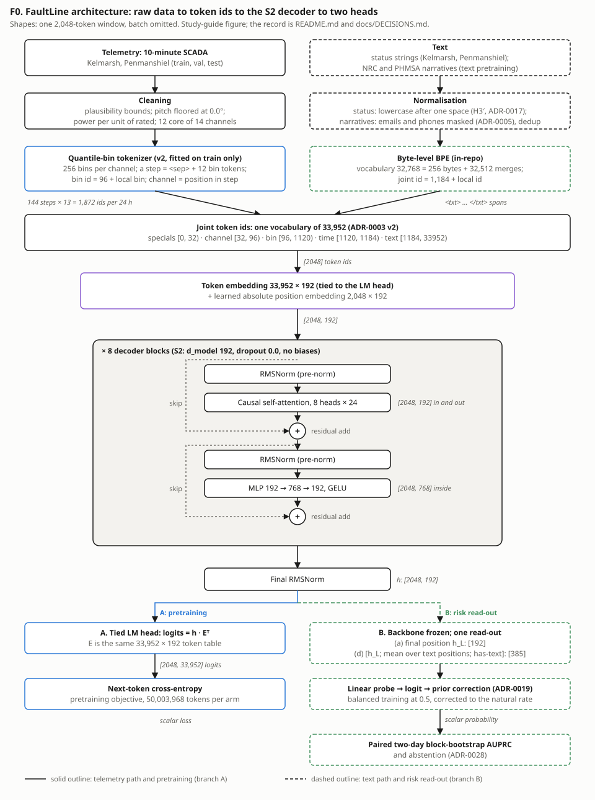
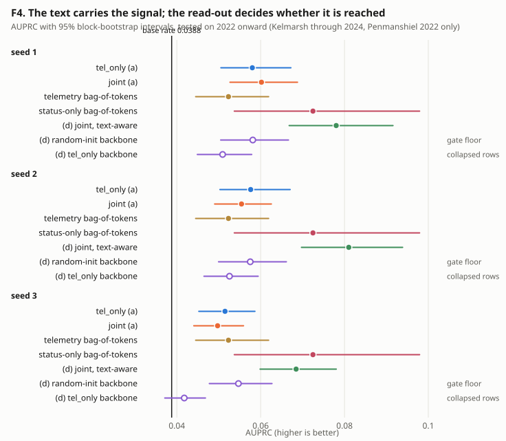
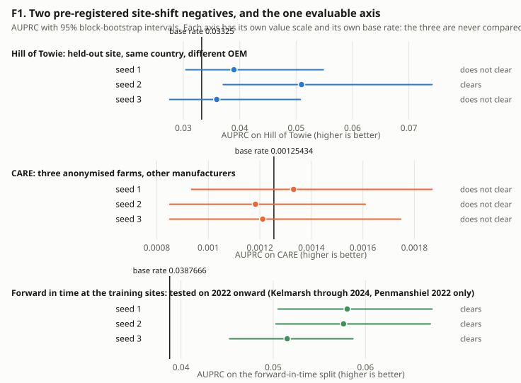
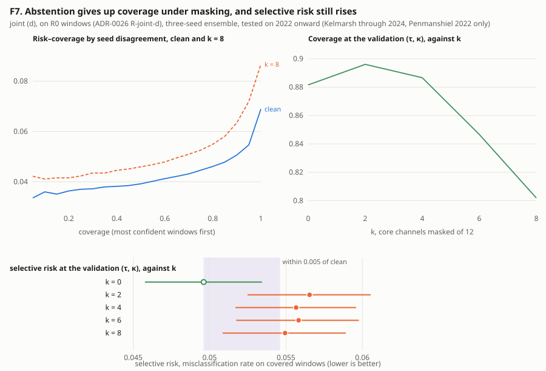

# What does a from-scratch telemetry–text language model learn about wind-turbine faults? A pre-registered, controlled study

**Sarvarbek Erniyazov**

Research summary for expert review — the canonical record is [docs/DECISIONS.md](DECISIONS.md)

Written against commit `450f024` · 2026-09-26 · Repository: <https://github.com/Sarvarbek-Erniyazov/FaultLine>

*Conventions.* AUPRC is step-wise average precision. Brackets hold a 95% two-day block-bootstrap percentile interval (10,000 replicates, seed 20260916). π is the scored split's positive rate, which is the AUPRC of a no-signal scorer. "Seed" is the pretraining seed unless stated otherwise. Every model-versus-model comparison is a same-row paired Δ. Verdict words are those of `docs/DECISIONS.md`.

---

## 1. Summary

FaultLine is a controlled study of what a small decoder-only transformer, pretrained from scratch on one 8 GB GPU, encodes about the risk of a technical stop in the next 24 hours. It is pretrained on quantised 10-minute SCADA telemetry, on wind-turbine status strings, and on an unpaired corpus of US federal incident narratives. Every component is written in-repo. A frozen shallow probe reads the backbone on a forward-in-time split. Every model-versus-model comparison is paired and three-seeded, set beside random-init and order-blind controls, and it falls under one of eight gates whose rules were committed before their runs. Three results matter. (i) Each gain decomposes into a simpler control. Pretraining beats random initialisation by +0.009 to +0.019 AUPRC (9/9 paired intervals above zero), yet the telemetry model is at parity with an order-blind bag of tokens. (ii) The status text is invisible through a last-position read-out (H1 INCONCLUSIVE) and visible through a text-aware one (H1′ SUPPORTED, median Δ +0.0200). There it matches, and does not beat, an order-blind count of the status strings. (iii) Neither site-shift axis is evaluable. The registered attribution places the cross-OEM null in the token stream, and the author reads that as a tokenizer failure.

### Findings at a glance

| finding | key number (95% interval) | verdict | ADR |
|---|---|---|---|
| The frozen probe sees pretraining (telemetry-only) | Δ(trained − random-init), 3 × 3 seed pairs: +0.0092 to +0.0186; lowest lower bound +0.0045 (π = 0.0388) | PASS | 0024 |
| The telemetry model against an order-blind bag of tokens | Δ +0.0016 [−0.0059, +0.0084], +0.0053 [−0.0017, +0.0128], −0.0015 [−0.0094, +0.0053] (seeds 1–3) | parity (reported, not gated) | 0024 |
| H1: joint against `tel_only`, last-position read-out (a) | Δ +0.0022 [−0.0034, +0.0068], −0.0022 [−0.0084, +0.0021], −0.0018 [−0.0060, +0.0021] | **INCONCLUSIVE** | 0025 |
| H1′: joint through text-aware read-out (d) against `tel_only` (a) (registered after H1's result) | Δ +0.0200 [+0.0112, +0.0294], +0.0234 [+0.0128, +0.0342], +0.0170 [+0.0111, +0.0232]; instrument gate 9/9, weakest +0.0058 | **SUPPORTED** (gate **PASS**) | 0026 |
| Joint (d) against an order-blind status-string count | Δ +0.0055 [−0.0173, +0.0241], +0.0085 [−0.0141, +0.0265], −0.0040 [−0.0264, +0.0125] | parity (reported, not gated) | 0026 |
| Site shift: Hill of Towie (held-out site) and CARE (other OEMs) | lower bound clears π on 1 of 3 seeds (π = 0.03325) and on 0 of 3 seeds (π = 0.001254) | **NOT EVALUABLE**, both | 0021, 0022 |
| Graceful degradation under channel loss (H2) | at k = 8 masked channels: Δcoverage −0.0797 [−0.0841, −0.0753], Δselective risk +0.0053 [+0.0033, +0.0074] | **INCONCLUSIVE** (Gate A **PASS**) | 0028 |

---

## 2. Problem and motivation

SCADA data are heterogeneous across manufacturers (OEMs) in channels and value distributions. The operator text that public records pair with telemetry is sparse, short and vendor-specific. Kelmarsh publishes 217 distinct status strings and Penmanshiel 231, all Senvion templates with a median length of 5 BPE tokens. Hill of Towie (Siemens) publishes alarm codes rather than strings, and its described codes are all non-technical. CARE supplies no status strings to the input. No public wind source pairs telemetry with free text (ADR-0001). A joint model therefore has template strings interleaved with telemetry, and unpaired narrative from other industries.

Pretrained foundation models are proposed for time series [cite] and SCADA [cite], increasingly with text [cite]. The questions here are prior to scale. Does pretraining put anything a frozen probe can read into the representation? Is it more than a token histogram? Does text help, and through which path? Does any of it survive a later period, another site or another OEM?

Everything ran on one NVIDIA GeForce RTX 4060 (8 GB), with one small rung (S2, about 10.5M parameters, chosen for comparability across arms), a matched budget of 50,003,968 tokens per arm, and three seeds. Evaluation is forward in time (train 2016–2020, test 2022 onward), because adjacent 10-minute windows are near-copies and a random split measures interpolation. Every model-versus-model comparison is a paired interval, and every positive claim has a control that could falsify it.

---

## 3. Method

### 3.1 Task, labels and leakage

**One label rule at every site (ADR-0009).** Every source is reduced to seconds of downtime per turbine and step, split into five causes: technical, environmental, grid, planned and unknown. One function with no source argument (`harmonise.select_events`) turns that into events: consecutive steps holding downtime of the chosen causes, lasting at least 60 s. The primary **narrow** label keeps technical downtime only. Environmental, grid and planned stops are excluded by cause, through provider status categories at the Senvion sites (`configs/data/events_v2.yaml`) and stop-class timers read by behaviour at Hill of Towie. Low wind is not a stop class, so it is `unknown` and never narrow. Targets come only from stops, and warnings are inputs only. The sites read 13.4, 16.5 and 16.5 narrow events per turbine-year (Kelmarsh, Penmanshiel, Hill of Towie), against 6.5–34.0 between years at Kelmarsh.

**Task.** At window end t, predict `narrow_within_24h`: does a narrow event start in (t, t + 144] steps? A horizon running past the record is unknown, never negative. The input is the 144 steps ending at t (1,872 telemetry tokens).

| split (windows as scored) | windows | positive | π |
|---|---:|---:|---:|
| train, Kelmarsh + Penmanshiel, stride 6 | 749,387 | 16,524 | 0.0221 |
| validation 2021, stride 12 | 85,529 | 1,805 | 0.0211 |
| test 2022+, pooled, stride 12 | 137,025 | 5,312 | 0.0388 |
| · of which Kelmarsh / Penmanshiel | 77,203 / 59,822 | 2,841 / 2,471 | 0.0368 / 0.0413 |
| Hill of Towie, seeded 12,000-window subsample | 12,000 | 399 | 0.03325 |
| CARE, stride 12 (45 events) | 430,506 | 540 | 0.001254 |

The test π is 1.8× the training π. ADR-0009 traces the rise to the message `anemometer defect`, which opens more than one narrow event per turbine-year at both sites from 2021, the year the status export gained two columns. The record reads this as pointing to a reporting or firmware change. Without those events the test π is still 0.0243, and Kelmarsh 2024 stays above training unexplained. The record registers the late split as "a temporal hold-out with a change in what is labelled, not a drift test", and requires results with and without those events (§7).

**Leakage rule for status strings (ADR-0025 §3).** A message is attached to the first step at or after its start, with the start rounded *up* to the grid. Labels count only events starting strictly after t, with event starts floored to the grid. A window ends at step t's last token, messages included, so read-through is structurally impossible. The F6-R reconnaissance that the registration cites measured it: no message starting at or after the labelled event's onset appears in any train or test window. Every occurrence of the event's own code is an earlier `Stop` row, a recurrence. That is 1,060 of 2,841 Kelmarsh and 418 of 2,471 Penmanshiel test positives. Recurrence is information available at t, so the primary read (R0) keeps every row. A reported decomposition (R2) deletes every `Stop` row. The rule deletes no message. Messages whose step is absent from the final rows (a filtered outage, another split) are not written: 2,887 of 504,180 at Kelmarsh and 4,923 of 839,303 at Penmanshiel (ADR-0018). Two further losses matter for positives: 1,088 of 5,312 test positives carry no status token at all, and 2,081 (39.2%) lose leading steps, with their messages, to the 2,048-token context (§3.4).

### 3.2 Tokenization

**Telemetry.** Of 14 canonical channels, 12 are *core*: present at both training sites, mappable at Hill of Towie, and meeting ADR-0008's measured conditions (wind direction was demoted by them). Each core channel gets 256 bins, fitted on the training split only (`configs/tokenizer/quantile_bins_v2.yaml`). The bins are built in four steps. (1) Point masses come first: a value holding ≥ 1/256 of a channel's training values gets its own bin, up to 16 per channel. (2) Fixed-width tail bins are laid beyond train p0.5/p99.5, **4 per side in the fit in force**. v1 used 16 and was cut under a pre-registered signal: 184 of 352 tail bins held fewer than 500 values. (3) The outermost tail bin is merged inward until it holds 0.1% of values. (4) Quantile bins fill the centre. Missing values become `<nan>` (id 9), and out-of-range values clamp. A step is `<sep>` (id 8) plus the 12 core bins in fixed order: 13 tokens.

**The (channel, bin) → id map has no channel term.** The local bin is b = searchsorted(that channel's interior edges, value, right), clipped to [0, 255] ([quantile_bins.py:617-618](../src/faultline/tokenizers/quantile_bins.py#L617-L618)). The id is **96 + b for every channel** ([joint.py:203](../src/faultline/tokenizers/joint.py#L203); `BIN_OFFSET` = 32 + 64, [layout.py:85-86](../src/faultline/tokenizers/layout.py#L85-L86)). The 12 × 256 pairs share ids [96, 352), and the channel is carried by position: the k-th token after `<sep>` is channel k ([joint.py:208-209](../src/faultline/tokenizers/joint.py#L208-L209)). The decoder therefore uses learned absolute positions. The channel block is reserved and never emitted. One consequence matters in §5.3: an id means "the b-th interval of this channel's *training-site* distribution", so it carries a different physical value at another OEM.

**Text.** A byte-level BPE is implemented in the repository. Its vocabulary of 32,768 is 256 bytes plus 32,512 merges, fitted on the NRC + PHMSA training split, whose shards hold 10,043,874 training tokens. Status strings are normalised on the frozen tokenizer (ADR-0017: `" " + s.lower()`). The strings (of 264) whose every token is frequent in training rose from 18 to 80. That token-coverage count was later retired as a metric that cannot fail (audit entry 11); the surviving evidence is behavioural, per-string NLL.

**Joint vocabulary (ADR-0003 v2): 33,952 ids.** Offsets derive from fixed capacities, never counts in use.

| block | ids | capacity | in use |
|---|---|---:|---|
| specials | [0, 32) | 32 | 11 (`<pad>` 0 … `<txt>` 4, `</txt>` 5, `<sep>` 8, `<nan>` 9, `<mask>` 10) |
| channel | [32, 96) | 64 | 14 defined, none emitted |
| bin | [96, 1120) | 1,024 | 256 (ids 96–351) |
| time | [1120, 1184) | 64 | reserved |
| text | [1184, 33952) | 32,768 | all |

### 3.3 Model and pretraining

**S2** is a decoder-only causal transformer: 8 layers, d_model 192, 8 heads, a 4× GELU MLP, no biases, pre-norm RMSNorm, a tied head, 2,048 learned positions and dropout 0. It has 3,542,208 backbone and 10,454,208 total parameters. A test asserts causality at this specification (atol 1e-6). Each arm trains on next-token loss for exactly **50,003,968 tokens**: 763 steps × 32 windows × 2,048. AdamW, peak 6e-4, 2% warmup, cosine to 0.1×, weight decay 0.1, bf16. An initial-loss guard refuses a first batch outside [ln V − 0.50, ln V + 0.10] of ln 33,952 = 10.4327. The arms are `tel_only` (tel 1.0) and `joint` (tel 0.30 · txt 0.20 · tel+status 0.50), with three seeds each. 50M is the largest round budget under which no stream repeats: txt gets 0.996 passes.

**Why S2.** ADR-0018 fixed all arms at one rung "for comparability, not performance". One S2 arm's pretraining measured 609.9 s (about 0.17 GPU-hours). The text-only ladder gives no reason to go larger. S2 and S3 each saw 10,027,008 tokens (0.98 and 0.50 tokens per parameter), S3's validation loss was not lower (6.1977 against 6.1474 nats), and the record concludes that "a ladder over a corpus of about 10M tokens cannot demonstrate scaling". Every model here is undertrained by that diagnosis.

### 3.4 Read-outs

The text result changes sign between two read-outs of the same frozen backbones, so this subsection carries the methodological weight.

**The probe.** The backbone is frozen. The head is RMSNorm(width) → Linear(width → 192) → GELU → Linear(192 → 1) ([risk.py:111-168](../src/faultline/model/risk.py#L111-L168)). The record calls it a "linear head" with "one hidden layer". Probes see 16,000 positives over 1,000 steps (16 × 2, rate 2e-3) under **balanced sampling** at 0.5. The **ADR-0019 prior correction**, z + logit(0.0221) − logit(0.5) = z − 3.79, restores the training natural rate. It moves calibration, not AUPRC.

**Fixed final step (ADR-0022 addendum).** The selection split (6,000 windows, 117 positives, 78 positive blocks) cannot rank checkpoints. The selected trained checkpoints read 0.0471 [0.0289, 0.0902], 0.0382 [0.0255, 0.0607] and 0.0382 [0.0243, 0.0708] (seeds 1–3, π ≈ 0.020). The untrained head's step-0 read, 0.0447 (seed 1; point value only), lies inside all three. The addendum's one-sided criterion was written **after the F3 point estimates were read** (final ≥ selected on all six probes), before any paired interval existed. Δ(final − selected) was +0.0041 [+0.0022, +0.0066] (seed 1) and +0.0007 [+0.0002, +0.0011] (seed 3), and trained-against-random passed 9/9 final-against-final. Every probe since is read at its last step.

**The read-outs** (ADR-0026 §2). h is the final-layer states, and L is the last real (non-`<pad>`) position.

- **(a) `final_position`**: h_L, width 192. This is H1's registered probe.
- **(b) `mean_all`**: the mean of h over the real positions, width 192. It is a pooling-only control.
- **(d) `last_plus_text`**: [h_L ; mean of h over text-token positions (`<txt>`, `</txt>`, id ≥ 1,184) ; has-text flag], width 385. Without text the middle block is zero and the flag is 0, so **(d) reduces to (a) plus a constant** on the 28.6% of test windows that carry no text.

**Why (a) may miss the text.** The joint window (`tail_anchored_2048`) ends at step t's last token, and leading steps are dropped until it fits 2,048 tokens. Its last real position is always a telemetry bin; messages sit earlier. Read-out (a) sees text only if the backbone routes it forward into that one vector.

**Why (d) needed a control.** Through an *untrained* backbone, the text mean is close to a bag of text-token embeddings, which may rank risk by itself. ADR-0026 registered a **random-init gate on the instrument**. (d) on each trained joint backbone must beat (d) on each of three random-init backbones: 9/9 paired lower bounds above zero. Otherwise H1′ is NOT EVALUABLE, with the pre-written conclusion "whatever (d) harvests is the tokens' embeddings, not the pretraining". (d) on `tel_only` backbones and (b) are further controls.

### 3.5 Evaluation protocol

**Split** (`configs/data/splits_v3.yaml`): train to 2020, validation 2021, test 2022 onward (Penmanshiel 2022 only; its 2023–2024 files were never staged). The pooled test split is thinned to stride 12, which keeps 5,799 of 5,800 two-day blocks and 497 of 506 positive blocks.

**Statistics.** A block is a window's end step integer-divided by 288 within its shard: 48 h, twice the horizon. A replicate resamples the occupied blocks with replacement. A replicate without a positive is discarded, and more than 1% discarded untrusts the interval. No deciding row here discarded any. **Every comparison is paired**: both models are scored on identical resampled rows, and the interval is on Δ.

**Why paired.** ADR-0023's criterion required the trained model's interval to clear each random-init interval, each bootstrapped alone. Two models scored on the same windows have correlated estimates, so non-overlap of two 95% intervals is far stricter than a 5% test. ADR-0024 §1 shows the rule "could not have passed at any of the four designs". The four ADR-0023 FAILs stand. **ADR-0024's paired criterion was registered after those FAILs were seen**, and before any paired interval existed.

**Controls.** (1) Random-init backbones: init seeds 1–3, no optimiser step, the same probe. (2) An order-blind bag of tokens: logistic regression on per-window token counts, trained with the probe's sampler (seed 1) on CPU. (3) An order-blind status-only classifier: the same model over text ids and `<txt>`/`</txt>` only, where an empty window is a zero histogram. It replaces a `txt_only` arm, which could not read the 1,088 empty positives.

**Decision rule.** The smallest effect of interest is 0.005 AUPRC, which is the resolution limit: seed spread 0.0068, single-seed half-width 0.0072. **SUPPORTED** if all three same-seed paired lower bounds exceed 0 and the median Δ exceeds 0.005. **REFUTED** if all three upper bounds are below 0.005. **INCONCLUSIVE** otherwise. Unnamed outcomes are reported as measured, and no clause is added afterwards.

### 3.6 Pre-registration mechanics

Each rule is committed before any scoring code exists. From ADR-0022 onward, its configuration by value and a test that parses the rule are committed with it. The next commit records the hash. The outcome follows in a later commit, and a configuration a run has read is never edited.

| gate | registered | hash recorded | code or run | outcome |
|---|---|---|---|---|
| ADR-0025 (H1) | `3e29202` | `7a03201` | scoring at `4cf68b9` | `23699ee` |
| ADR-0026 (H1′) | `319ae3b` | `ce0eb5a` | read-outs `f945a11` | `9beebaa` |
| ADR-0028 (H2) | `8f7f10e` | `b62c145` | operating point `1ad1890`, committed alone before any test file was opened | `b659897` |

[INSTRUMENT_AUDIT.md](INSTRUMENT_AUDIT.md) records every case where an instrument or premise was the defect, each with its counterfactual result (§6).

---

## 4. Data

| source | OEM / model, or content | role | years / split | scale | licence | provenance notes |
|---|---|---|---|---|---|---|
| Kelmarsh | Senvion MM92 × 6, 2,050 kW | train / val / test | train 2016–2020 · val 2021 · test 2022–2024 | 1,527,681 train steps; 941,165 test steps; 217 status strings | CC BY 4.0 | Cubico; Zenodo 16807551; 11 files, md5 verified |
| Penmanshiel | Senvion MM82 × 14 (WT03 absent), 2,050 kW | train / val / test | train 2016–2020 · val 2021 · test **2022 only** | 3,210,913 train steps; 729,158 test steps; 231 status strings | CC BY 4.0 | Cubico; Zenodo 16807304; 2023–2024 files are tier 2, never staged |
| Hill of Towie | Siemens SWT-2.3-VS-82 × 21, 2,300 kW | held-out site, test only | 2019 and 2023 staged | 2,199,043 steps; scored on 12,000 windows (399 positive) | CC BY 4.0 | RES for TRIG; Zenodo 14870023; alarm codes, not status strings; AeroUp retrofit 2021–2023 |
| CARE to Compare | 36 turbines, 3 anonymised farms (A: 5 onshore, Portugal; B, C: offshore, Germany) | cross-OEM evaluation only | every row is test; timestamps anonymised | 5,240,630 steps; 430,506 scored windows; 45 events (12 / 6 / 27) | CC BY-SA 4.0 | Fraunhofer IEE; farm A: EDP Open Data → Fraunhofer IEE → CC BY-SA 4.0; evaluation-only (`eval_only_sources`, share-alike; ADR-0001 evidence, ADR-0004 policy); no status strings |
| NRC | 5 collections: event notifications, information notices, bulletins, generic letters, regulatory issue summaries | unpaired text pretraining | own train / val / test by content hash | with PHMSA: 10,043,874 train tokens | public domain (17 U.S.C. 105) | pinned by sha256 per document; keyed dedup removed 4,521 superseded revisions |
| PHMSA | US pipeline incident narratives, 2010 onward | unpaired text pretraining | as NRC | 10,033 staged, 9,659 after the pipeline; 1,969,035 train tokens | public domain (17 U.S.C. 105) | data.transportation.gov 27nc-rsge; PII policy: emails and phone numbers masked |

**Cleaning, checksums and splits.** Values outside plausibility bounds (for example wind speed 0–40 m/s, pitch −5° to 100°) become missing, as do provider sentinels such as Kelmarsh gearbox oil at 323.7. Pitch is floored at 0.0° after the bound (ADR-0012), and power is per unit of rated power (ADR-0013). Kelmarsh 2023–2024 exports, which repeat each label about 41 times, are collapsed once the collapse is shown to be lossless. Telemetry is md5-verified, and text is pinned by sha256. **CARE's channels:** an unmapped core channel is emitted as `<nan>` on every step. Farm A lacks main-bearing temperature (8.35% `<nan>`). Farms B and C each lack three channels (25.01% and 25.22%), against 0.15% and 0.36% on the training-site test splits. None of 749,847 pretraining windows carries any CARE farm's pattern, and ADR-0022 states that confound beside every CARE row.

---

## 5. Results

§5.1–5.2 and §5.4–5.5 are on the pooled Kelmarsh + Penmanshiel stride-12 test split (π = 0.0388), forward in time at the training sites. **None is a site-shift result.**

### 5.1 The read-out decides whether the text is visible (ADR-0025, ADR-0026)

| read (all final-step probes; π = 0.0388) | seed 1 | seed 2 | seed 3 |
|---|---|---|---|
| `tel_only`, (a), M1 1,872-token windows | 0.0580 [0.0505, 0.0672] | 0.0576 [0.0503, 0.0670] | 0.0515 [0.0453, 0.0586] |
| joint, (a), R0 windows | 0.0602 [0.0527, 0.0688] | 0.0554 [0.0490, 0.0626] | 0.0497 [0.0441, 0.0559] |
| joint, (a), text withheld (M1 windows; different windows, not paired) | 0.0558 [0.0491, 0.0631] | 0.0543 [0.0480, 0.0612] | 0.0543 [0.0477, 0.0616] |
| joint, (b) `mean_all` | 0.0576 [0.0502, 0.0660] | 0.0654 [0.0565, 0.0758] | 0.0591 [0.0515, 0.0677] |
| **joint, (d) `last_plus_text`** | **0.0780 [0.0668, 0.0916]** | **0.0810 [0.0697, 0.0939]** | **0.0685 [0.0599, 0.0780]** |
| `tel_only` backbone, (d) | 0.0509 [0.0449, 0.0579] | 0.0526 [0.0465, 0.0594] | 0.0418 [0.0371, 0.0468] |
| random-init backbone, (d) (init seed) | 0.0581 [0.0505, 0.0666] | 0.0575 [0.0500, 0.0661] | 0.0547 [0.0478, 0.0627] |
| order-blind status-only classifier (sampler seed 1; one fit) | 0.0725 [0.0537, 0.0979] | — | — |

| paired comparison | seed 1 | seed 2 | seed 3 | reading |
|---|---|---|---|---|
| **H1**: joint (a) − `tel_only` (a) | +0.0022 [−0.0034, +0.0068] | −0.0022 [−0.0084, +0.0021] | −0.0018 [−0.0060, +0.0021] | **INCONCLUSIVE** (median −0.0018) |
| **H1′**: joint (d) − `tel_only` (a) | +0.0200 [+0.0112, +0.0294] | +0.0234 [+0.0128, +0.0342] | +0.0170 [+0.0111, +0.0232] | **SUPPORTED** (median +0.0200) |
| gate: joint (d) − random-init (d), same-seed cell | +0.0199 [+0.0128, +0.0290] | +0.0235 [+0.0166, +0.0318] | +0.0138 [+0.0090, +0.0187] | **PASS** 9/9; weakest cell +0.0058 (seed 3 vs init 1) |
| joint (d) − `tel_only` backbone (d) | +0.0271 [+0.0196, +0.0366] | +0.0285 [+0.0199, +0.0386] | +0.0267 [+0.0209, +0.0331] | reported |
| joint (b) − joint (a) | −0.0026 [−0.0068, +0.0017] | +0.0100 [+0.0051, +0.0164] | +0.0094 [+0.0054, +0.0142] | reported; no consistent sign |
| joint (d) − status-only classifier | +0.0055 [−0.0173, +0.0241] | +0.0085 [−0.0141, +0.0265] | −0.0040 [−0.0264, +0.0125] | reported; parity |
| `tel_only` backbone (d) − random-init (d) | −0.0072 [−0.0125, −0.0022] | −0.0050 [−0.0110, +0.0007] | −0.0129 [−0.0190, −0.0077] | reported |

**H1 through (a).** Seed 1's upper bound (0.0068) blocks REFUTED; no lower bound clears zero. Control (iii), an (a) probe on the frozen `tel_only` backbone over the joint windows, explains why. The input change alone costs −0.0122, −0.0096 and −0.0076, with every interval below zero, through truncation plus text the backbone cannot read. Joint pretraining at identical input recovers +0.0144, +0.0075 and +0.0059, with every interval above zero. The two cancel.

**H1′ through (d)** was registered after H1's INCONCLUSIVE result was seen, and is evaluated on the same test windows. The gate passes 9/9, so (d) reads more than token embeddings. The gain sits where the text is. The has-status stratum holds **97,810 of 137,025 test windows (71.4%)** and 4,224 of 5,312 positives (π = 0.0432). In it, Δ(joint (d) − `tel_only` (a)) is +0.0252 [+0.0158, +0.0357], +0.0260 [+0.0142, +0.0375] and +0.0145 [+0.0070, +0.0220]. In the no-status stratum (π = 0.0277) the sign is inconsistent. Pooling alone does not produce the gain. A `tel_only` backbone reads text no better than an untrained one. Its text-embedding rows collapsed onto one shared vector (measured on seed 2), which is the plausible reason, though this test does not establish it.

**Parity with counting strings.** The status-only classifier is above every (a) probe, and joint (d) is level with it. Its signal is partly recurrence. With every `Stop` row removed (R2) it reads 0.0597 [0.0468, 0.0785] (π = 0.0388, sampler seed 1), and its paired lift over the telemetry bag falls from +0.0202 [+0.0007, +0.0453] to +0.0074 [−0.0070, +0.0259]. R2 was not measured for (d).

*Reading.* The text signal sits at the joint backbone's text positions and is linearly recoverable there, not at the last position. What is recovered matches, and does not exceed, an order-blind count of the strings. Part of it is available from an untrained backbone's embeddings: random-init (d) reads above trained `tel_only` (a) on seeds 1 and 3 and within 0.0001 of it on seed 2 (first table).

### 5.2 Pretraining against random initialisation and a bag of tokens (ADR-0024)

| read (π = 0.0388) | seed 1 | seed 2 | seed 3 |
|---|---|---|---|
| random-init backbone, (a), final step (init seed) | 0.0416 [0.0370, 0.0467] | 0.0419 [0.0374, 0.0468] | 0.0418 [0.0371, 0.0470] |
| order-blind telemetry bag of tokens (sampler seed 1; one fit) | 0.0523 [0.0445, 0.0619] | — | — |

Each trained `tel_only` seed is compared against each of three random-init seeds. **All nine paired lower bounds are above zero** (PASS). On the checkpoints the F3 rule selected, Δ runs from +0.0092 to +0.0186, with the lowest lower bound at +0.0045. Final-against-final (the table above), the range is +0.0096 to +0.0164 and the lowest lower bound is +0.0047. The bag-of-tokens Δs are also against the selected checkpoints. Against the bag of tokens, Δ is +0.0016 [−0.0059, +0.0084], +0.0053 [−0.0017, +0.0128] and −0.0015 [−0.0094, +0.0053]. *Reading:* pretraining moves a frozen probe by a quarter to a half of π, and buys nothing measurable over a token histogram.

### 5.3 Site shift (ADR-0021, ADR-0022)

| axis | π | seed 1 | seed 2 | seed 3 | seeds clearing π | verdict |
|---|---:|---|---|---|---|---|
| Hill of Towie (12,000 windows) | 0.03325 | 0.0390 [0.0304, 0.0548] | 0.0510 [0.0371, 0.0741] | 0.0359 [0.0276, 0.0508] | 1 of 3 | **NOT EVALUABLE** |
| CARE (430,506 windows, 45 events) | 0.001254 | 0.0013 [0.0009, 0.0019] | 0.0012 [0.0009, 0.0016] | 0.0012 [0.0008, 0.0017] | 0 of 3 | **NOT EVALUABLE** |
| training-site forward-in-time test | 0.0388 | 0.0580 [0.0505, 0.0672] | 0.0576 [0.0503, 0.0670] | 0.0515 [0.0453, 0.0586] | 3 of 3 | EVALUABLE |

The ADR-0021 gate itself read 0.0393 [0.0306, 0.0553] (seed 1) and was NOT EVALUABLE. Hill of Towie is marginal, not null. CARE is at chance, per farm as well as pooled. **The project has no evaluable shift axis.**

**Attribution (ADR-0022 F6-0, registered before it ran).** *F6-0a:* each CARE farm's missing-channel pattern was imposed on the training-site test split. All nine masked reads stay above 0.0388, the lowest lower bound being 0.0421. Farm A's CARE null is therefore read as failure to transfer. Farms B and C meet neither clause and stay unattributed. *F6-0b:* the telemetry bag of tokens, not refit, scores 0.001940 [0.001233, 0.003830] on CARE (π = 0.001254, sampler seed 1). Its lower bound sits 0.000021 below π, so the registered clause holds: "the null is a property of the token stream across OEMs". *Reading:* no registered clause attributes any farm's null to the missing channels. Farm A is read as the pretrained backbone's failure to transfer, and the pooled order-blind result places the null in the token stream across OEMs. The tokenizer-level reading is the author's interpretation, and §3.2's shared-id design makes it plausible: bins fitted on one OEM family's distributions do not carry across OEMs. The evidence does not isolate it, and no per-site or rank-normalised tokenizer was tried.

### 5.4 Pretraining-content ablations (ADR-0027)

| arm | (d) AUPRC, seeds 1 / 2 / 3 (π = 0.0388) | gate | Δ against joint (d), seeds 1 / 2 / 3 | verdict |
|---|---|---|---|---|
| `joint_no_txt` (no narrative corpus; tel+status exposure held at 25,001,984 tokens) | 0.0750 [0.0657, 0.0853] / 0.0663 [0.0578, 0.0757] / 0.0672 [0.0589, 0.0764] | **PASS** 9/9, weakest +0.0041 | −0.0030 [−0.0102, +0.0026] / −0.0147 [−0.0207, −0.0101] / −0.0013 [−0.0040, +0.0015] | **INCONCLUSIVE** |
| `joint_status_raw` (status strings in provider casing) | 0.0719 [0.0625, 0.0828] / 0.0773 [0.0668, 0.0894] / 0.0777 [0.0672, 0.0895] | **FAIL** 4/9, weakest −0.0058 | −0.0061 [−0.0122, −0.0014] / −0.0037 [−0.0086, +0.0009] / +0.0092 [+0.0050, +0.0142] (as measured) | **NOT EVALUABLE** |

On raw-cased windows the untrained backbones read 0.0665 [0.0547, 0.0824], 0.0653 [0.0551, 0.0780] and 0.0651 [0.0537, 0.0805] through (d) (init seeds 1–3; π = 0.0388), above their normalised reads (§5.1). *Reading:* the narrative corpus's contribution is undecided, as registered in advance as the likeliest outcome. On raw strings the instrument cannot separate pretraining from the tokens.

### 5.5 Calibration and abstention (ADR-0028)

Each arm is a three-seed ensemble, p = mean of sigmoid(z_s), with seed disagreement u = std(z_s) as its confidence signal. τ (the F1 maximiser) and κ (90% coverage) are fixed on 2021 validation before any test file is opened.

| arm (R0 windows, three-seed ensemble; test π = 0.0388) | clean AUPRC | ECE, 15 equal-mass bins | ECE after validation-fitted Platt | mean p (after Platt) | Gate A: Δ AURC(disagreement − random) |
|---|---|---|---|---|---|
| `tel_only` backbone, (a) (ADR-0025 control iii) | 0.0479 [0.0426, 0.0536] | 0.0181 [0.0143, 0.0219] | 0.0181 [0.0144, 0.0219] | 0.0207 (0.0206) | −0.0158 [−0.0177, −0.0140] **PASS** |
| joint, (a) | 0.0567 [0.0499, 0.0643] | 0.0194 [0.0157, 0.0232] | 0.0184 [0.0147, 0.0222] | 0.0193 (0.0204) | −0.0184 [−0.0206, −0.0163] **PASS** |
| joint, (d) | 0.0793 [0.0687, 0.0916] | 0.0172 [0.0135, 0.0209] | 0.0164 [0.0127, 0.0201] | 0.0216 (0.0224) | −0.0275 [−0.0302, −0.0250] **PASS** |

On test, the mean p (0.019–0.022) is about half of π, and Platt fitted at the validation π of 0.0211 does not fix it. The test under-read is at least partly the post-2021 rise in the event rate, which Platt at 0.0211 cannot remove. The record also finds an in-time component, a property of the probe: `tel_only`'s selected-step probes read corrected means of 0.0185, 0.0183 and 0.0217 on 2021 validation (π = 0.0211), so two of three seeds under-read in-time. Scores are rankings, not risks, without recent recalibration.

**Gate B and H2.** On `joint` (d), k of 12 core channels are masked to `<nan>`, with the text kept and nested sets drawn once with seed 20260924. Gate B, Δ AUPRC(k = 8 − clean), is −0.0039 [−0.0082, −0.0001]: damage, by 0.0001. For H2 at fixed (τ, κ), Δcoverage is −0.0797 [−0.0841, −0.0753] and Δselective risk is +0.0053 [+0.0033, +0.0074]. The upper bound misses +0.005 and coverage is not flat, so H2 is **INCONCLUSIVE**. Selective risk steps up by k = 2, and coverage falls only from k = 6. The ensemble at k = 2 reads 0.0867 [0.0748, 0.1005], above the clean read; this is reported, not interpreted. Calibrated abstention implemented and evaluated; graceful degradation not established.

### 5.6 Instrument findings

**Checkpoint selection is noise at 117 positives** (§3.4). Where the test split distinguishes the two checkpoints, it favours the final one. The most consequential [INSTRUMENT_AUDIT.md](INSTRUMENT_AUDIT.md) entries:

- **Entries 9, 11 and 12: the wrong unit, then metrics that could not fail.** H3's split was drawn in words while the model reads tokens. Token coverage could not fail for an absent word (`yaw` never occurs in training, yet `Yaw error` reads as covered), and its replacement saturated. Per-string NLL survives.
- **Entry 10: the gate chain did not gate.** `pytest | tail` returned `tail`'s exit status. It is now a `pipefail` script with a test, and eleven earlier commits were re-gated.
- **Entry 1: a dedup trigger blind to its target.** Keyed dedup then removed 4,521 superseded revisions.
- **Entry 13: properties asserted only at toy scale.** Causality, initial loss and padding were re-asserted at the real specification before the joint arm ran.

### Gate ledger

| gate | hypothesis / question | registered | outcome commit | verdict | key numbers |
|---|---|---|---|---|---|
| ADR-0021 | Hill of Towie separates `tel_only` from chance | `ce9c8ad` | `ed60e8d` | **NOT EVALUABLE** | seed 1: 0.0393 [0.0306, 0.0553], π 0.03325 |
| ADR-0022 | choose the primary axis; CARE | `801ab71` | `d87a524` | CARE **NOT EVALUABLE**; temporal EVALUABLE | CARE 0/3 seeds; temporal 3/3 |
| ADR-0022 addendum | fixed-final-step selection | `4622564` | `267147d` | adopted | Δ(final − selected) +0.0041, +0.0007 |
| ADR-0022 F6-0 | attribute the CARE null | `ad1b7a3` | `0bcbd01` | farm A: transfer failure; B, C unattributed; token stream | lowest masked lower bound 0.0421; bag on CARE 0.001940 [0.001233, 0.003830] |
| ADR-0023 | probe sees pretraining (non-overlap) | `c9489a2` | `81a8fab` (§a) … `95a2cef` (§d) | **FAIL** (§a–§d) | §a: lower bound 0.0434 against random-init upper bound 0.0500 |
| ADR-0024 | probe sees pretraining (paired) | `79d4e97` | `f6c2df0`; F3 `d16e93f` | **PASS** | 9/9; +0.009 to +0.019 |
| ADR-0025 | H1 | `3e29202` | `23699ee` | **INCONCLUSIVE** | median −0.0018 |
| ADR-0026 | H1′ + instrument gate | `319ae3b` | `9beebaa` | **SUPPORTED**; gate **PASS** | median +0.0200; gate 9/9 |
| ADR-0027 | narrative corpus; surface form | `179d769` | `183b1a0` | **INCONCLUSIVE**; **NOT EVALUABLE** | median −0.0030; gate 4/9 |
| ADR-0028 | H2 + Gates A, B | `8f7f10e` | `b659897` | Gate A **PASS** ×3; Gate B damage; H2 **INCONCLUSIVE** | Δcov −0.0797; Δrisk +0.0053 [+0.0033, +0.0074] |

---

## 6. Why the evidence can be trusted

**Rules precede numbers.** Each of the eight gates was committed before its code existed. From ADR-0022 onward, the registration commit also carries the configuration by value and a test that parses the rule from the ADR text, so the file a run reads cannot drift from the record. ADR-0021, ADR-0023 and ADR-0024 were registered as text only ([ledger](../reports/data/ledger_gates.md)). ADR-0028's operating point was committed alone (`1ad1890`) before any test file was opened.

**Negative outcomes stand under the same rules.** Both shift axes are NOT EVALUABLE, and the leave-site-out demotion is registered as irreversible. ADR-0023's four FAILs remain beside the corrected criterion, and H1's INCONCLUSIVE stands beside H1′. ADR-0027 named INCONCLUSIVE as its likeliest outcome before running.

**Every positive claim had a falsifying control, and two framings fell.** The bag of tokens falsified the claim that the telemetry model learns sequence structure. The status-only classifier falsified the claim that the joint model extracts more from text than a string count. The random-init gate on (d) passed, and it also exposed how much of (d)'s level an untrained backbone reaches.

**The author audited their own measurement.** The audit has 15 entries, each with its counterfactual. Among them are a brief's 3.24 GPU-hours against the 3.37 in the timing records (entry 15), and a step-0 stop when a brief's premise contradicted its registration (entry 14). The ADR-0023 criterion error is recorded in ADR-0024 §1.

**Scale is stated.** Two-day block resampling, paired comparisons, a measured ~0.005 resolution, three seeds per arm and per control, one RTX 4060, and a programme floor of **18.2 GPU-hours** (Appendix B).

---

## 7. Limitations and threats to validity

**Low absolute performance.** The best clean single-probe read, joint (d) seed 2 at 0.0810 [0.0697, 0.0939], is 2.1× π = 0.0388. The masked three-seed ensemble at k = 2 and 4 reads about 0.087, still about 2.2× π. It is a ranking signal, not an alarm.

**Parity, not superiority.** Joint (d) matches an order-blind string count, and the telemetry model matches a token histogram. Nothing shows the sequence model extracting information a histogram cannot.

**No evaluable shift axis.** Every positive result is forward in time at the two training sites, a split the record calls in-distribution.

**Calibration fails under the base-rate shift.** Probabilities under-read π by about half on test, and Platt does not fix it.

**Post-hoc elements and test reuse.** H1′ (ADR-0026) was registered after H1's INCONCLUSIVE result was seen and is evaluated on the same test windows. The ADR-0022 addendum's criterion was written after point estimates were seen. ADR-0024's criterion followed ADR-0023's FAILs. H3, cross-OEM transfer of status semantics, was withdrawn at its pre-registered testability gate, measured after PHMSA joined the corpus: 0 of 693 Hill of Towie events and 0 of 45 CARE anomalies mapped to a string type. Sequential registrations on one test split are adaptive, and no confirmatory split untouched by any registration has been used. Penmanshiel 2023–2024 and Hill of Towie's unstaged years are candidates.

**An unmet reporting requirement.** ADR-0009 requires every late-test result with and without the `anemometer defect` events. Only F5's `tel_only` rows carry it: 0.0492 [0.0406, 0.0605], 0.0483 [0.0400, 0.0601] and 0.0383 [0.0322, 0.0454] (seeds 1–3) at π = 0.0243. The H1, H1′ and ADR-0027 reports quote the requirement, and ADR-0028's registers a narrower ADR-0009 caveat. None of the four gives the without-events numbers.

**Narrow training domain.** Both training farms are Senvion, from one publisher, and status volume shifts (Kelmarsh positives: 67.2 status tokens in training, 190.1 in test).

**Scale.** 3.5M backbone parameters and 50M tokens per arm, undertrained.

**No external baselines.** There is no feature-engineered GBDT, no normal-behaviour model and no pretrained time-series foundation model.

**One task definition, and a half-answered shortcut question.** R2 was measured for the status-only classifier and for joint (a), not for (d), which carries the positive result.

---

## 8. Request for expert feedback

What follows is a request for expert feedback — specifically, how would you strengthen the methodology, results, or framing to make this a strong top-tier submission (e.g., NeurIPS/ICML workshop, applied ML venue, or an energy-AI journal)? What's the strongest angle for a paper here — the read-out finding, the pre-registration framework, the negative-result methodology, or something else?

1. **Framing.** Which framing is strongest, and what would the one-sentence claim be? One candidate: "in a frozen joint telemetry–text model, sparse interleaved text is linearly present at the text positions and absent at the final position, so read-out choice alone flips the verdict — and the recovered signal equals a string count."
2. **Experiments.** Please rank, cut or add to these candidate experiments, marking any you consider mandatory:
   - decomposing read-out (d) (last-position only / text mean only / has-text flag only). No such breakdown exists in the record;
   - standard baselines: GBDT on engineered SCADA features plus status counts; a normal-behaviour model; a frozen pretrained time-series foundation model under the same probe;
   - a confirmatory test on data untouched by any registration;
   - a per-turbine or per-OEM normalisation tokenizer variant on CARE;
   - CARE under its published benchmark protocol;
   - one additional scale point.
3. **Test reuse.** Is test-set reuse across sequential, disclosed registrations acceptable, or does the paper need a fresh confirmatory set?
4. **Shortcut.** Despite the leakage rule, does the status-string pathway look like a shortcut to you? 1,478 of 5,312 test positives carry an earlier `Stop` row of the event's own code, and text presence alone separates π = 0.0432 from 0.0277.
5. **Venue.** Which venue fits the evidence as it stands, and which would fit after the experiments you consider mandatory?

---

## Appendix A — Evidence map

| claim (§) | ADR | report | registered → outcome |
|---|---|---|---|
| Label rule; events per turbine-year (3.1) | 0009 | [label report](../reports/data/20260910-212256_label_telemetry_20fa4ac5/label_stats_report.md) | accepted 2026-09-11 |
| Leakage measurement and R0 ruling (3.1) | 0025 §3 | [h1_controls_v0](../reports/data/h1_controls_v0_20260918.md) | `3e29202` → `23699ee` |
| Tokenizer v2, n_tail 4 (3.2) | 0014, 0015 | [quantile_bins_v2](../reports/data/quantile_bins_v2_20260912.md), [shards_v2](../reports/data/shards_v2_20260912.md) | config `quantile_bins_v2.yaml` |
| BPE 32,768 / 32,512 merges (3.2) | 0016 | [text_bpe_v1](../reports/data/text_bpe_v1_20260915.md), [text_shards_v1](../reports/data/text_shards_v1_20260915.md) | — |
| Status normalisation 18 → 80 of 264 (3.2) | 0017 | [h3prime_stage_a_v1](../reports/data/h3prime_stage_a_v1_20260916.md) | `d56684a` |
| S2 / S3 text ladder (3.3) | 0018 | [m2_gate6](../reports/data/m2_gate6_20260916.md) | — |
| Fixed final step (3.4) | 0022 addendum | [checkpoint_selection_v0](../reports/data/checkpoint_selection_v0_20260917.md) | `4622564` → `267147d` |
| ADR-0023 FAIL §a–§d (3.5, 6) | 0023 | [probe_control_v0](../reports/data/probe_control_v0_20260916.md) … [v3](../reports/data/probe_control_v3_20260916.md) | `c9489a2` → `81a8fab` … `95a2cef` |
| H1 INCONCLUSIVE; decomposition (5.1) | 0025 | [h1_gate_v0](../reports/data/h1_gate_v0_20260919.md) | `3e29202` → `23699ee` |
| Status-only 0.0725; R2 (5.1) | 0025 §4 | [h1_controls_v0](../reports/data/h1_controls_v0_20260918.md) | `3e29202` → `5c00dd6` |
| H1′ SUPPORTED; gate; (b), (d) controls; strata (5.1) | 0026 | [readout_v0](../reports/data/readout_v0_20260920.md) | `319ae3b` → `9beebaa` |
| Pretraining vs random init, 9/9 (5.2) | 0024 F3 | [seed_replication_v0](../reports/data/seed_replication_v0_20260917.md), [paired_control_v0](../reports/data/paired_control_v0_20260917.md) | `79d4e97` → `f6c2df0`; `0d6d6b4` → `d16e93f` |
| Bag-of-tokens parity (5.2) | 0024 §6 | [bag_of_tokens_v0](../reports/data/bag_of_tokens_v0_20260917.md) | `79d4e97` → `77390ba` |
| Hill of Towie NOT EVALUABLE (5.3) | 0021, 0022 §6 | [gate_check_v0](../reports/data/gate_check_v0_20260916.md), [seed_replication_v0](../reports/data/seed_replication_v0_20260917.md) | `ce9c8ad` → `ed60e8d` |
| CARE NOT EVALUABLE (5.3) | 0022 | [axis_gate_v0](../reports/data/axis_gate_v0_20260918.md) | `801ab71` → `d87a524` |
| CARE attribution (5.3) | 0022 F6-0 | [care_attribution_v0](../reports/data/care_attribution_v0_20260918.md), [fig5](../reports/data/fig5_care_attribution.svg) | `ad1b7a3` → `0bcbd01` |
| Ablations (5.4) | 0027 | [ablation_gate_v0](../reports/data/ablation_gate_v0_20260923.md) | `179d769` → `183b1a0` |
| Calibration, Gate A, Gate B, H2 (5.5) | 0028 | [abstention_v0](../reports/data/abstention_v0_20260924.md), [abstention_part_a_ece_v0](../reports/data/abstention_part_a_ece_v0_20260924.md), [operating points](../reports/data/abstention_operating_points_v0.json) | `8f7f10e` → `1ad1890` → `b659897` |
| In-time validation under-read (5.5) | 0024 F3 §6 | [seed_replication_v0](../reports/data/seed_replication_v0_20260917.md) | `b2ad4a7` → `d16e93f` |
| Anemometer-defect variant (7) | 0009, 0022 | [axis_gate_v0](../reports/data/axis_gate_v0_20260918.md) | `801ab71` → `d87a524` |
| Instrument audit entries (5.6, 6) | — | [INSTRUMENT_AUDIT.md](INSTRUMENT_AUDIT.md) | per entry |
| All paired comparisons in one view | — | [fig3_paired_deltas](../reports/data/fig3_paired_deltas.svg), [figures index](../reports/data/figures_index.md) | — |

## Appendix B — Reproduction

**Environment.** One supported environment: `uv sync --extra dev` from the committed [uv.lock](../uv.lock); torch 2.14.0 (`+cu132`); NVIDIA GeForce RTX 4060, 8 GB, driver 616.56 ([ENVIRONMENT.md](ENVIRONMENT.md)). Gates: `scripts/gates.sh` (ruff, ruff format, `mypy --strict`, pytest, naming, untracked files). Raw telemetry is downloaded from the version-pinned Zenodo records in `configs/data/sources_telemetry.yaml` and md5-verified. Text is fetched by `faultline download text` and pinned by sha256.

**Configurations and entry points.** Each `faultline model …` command defaults to the configuration shown and writes its report under `reports/data/` with the configuration hash and git SHA.

| phase | command | configuration |
|---|---|---|
| telemetry shards | `faultline telemetry shards` (pass the v2 tokenizer config; the CLI default is v0) | `configs/data/telemetry_v4.yaml`, `configs/data/splits_v3.yaml`, `configs/tokenizer/quantile_bins_v2.yaml` |
| text tokenizer / pretraining | `faultline text bpe`; `faultline model text-pretrain` | `configs/tokenizer/text_bpe_v1.yaml`; `configs/train/text_v1.yaml` |
| mixture shards | `faultline model mixture-shards --config configs/train/joint_v1.yaml` | `configs/train/joint_v1.yaml` (then `joint_v2.yaml`) |
| ADR-0021 gate | `faultline model gate-check` | `configs/train/gate_check_v0.yaml` |
| ADR-0023 §a–§d | `faultline model probe-control` | `configs/train/probe_control_v{0,1,2,3}.yaml` |
| ADR-0024 G1, G2, G3, F3 | `paired-control`, `bag-of-tokens`, `probe-cadence`, `seed-replication` | `paired_control_v0`, `bag_of_tokens_v0`, `probe_cadence_v0`, `seed_replication_v0` |
| ADR-0022 addendum, F5, F6-0 | `checkpoint-selection`, `axis-gate`, `care-attribution` | `seed_replication_v0`, `configs/eval/axis_gate_v0.yaml`, `configs/eval/care_attribution_v0.yaml` |
| ADR-0025 (H1) | `h1-controls`, `h1-arms`, `h1-score`, `h1-gate` | `bag_of_tokens_v1`, `h1_arms_v0`, `configs/eval/h1_gate_v0.yaml` |
| ADR-0026 (H1′) | `readout`, `readout-gate` | `configs/eval/readout_v0.yaml` |
| ADR-0027 | `ablation-arms`, `ablation-gate` | `configs/eval/ablation_gate_v0.yaml` (arms `configs/train/joint_v2.yaml`, `ablation_arms_v0.yaml`) |
| ADR-0028 | `abstention-score`, `abstention-ece`, `abstention-operating-point`, `abstention-outcome` | `configs/eval/abstention_v0.yaml` |
| figures | `faultline model figures` | reads committed reports only |

**GPU hours.** The programme floor is **18.2 GPU-hours** (README). It is 12.6 h summed from timing sidecars (98 records, eleven run directories), plus F8-2's 3.37 h and F9-2's 2.24 h. The telemetry ladder, text pretraining and order-blind comparators wrote no sidecar and are timed only in their own reports. Per phase, as each outcome in DECISIONS.md reports its wall clock:

| phase | GPU hours |
|---|---:|
| ADR-0023 probe control, §a–§d | 1.42 |
| ADR-0024 G1 (re-run probe, re-scorings, CPU bootstraps) | 0.84 |
| ADR-0024 F3 (two pretrainings, six probes; two invocations) | 2.66 + 2.20 |
| ADR-0022 F5 (five CARE scorings) | 1.72 |
| ADR-0022 F6-0a (nine masked scorings) | 1.02 |
| ADR-0025 F6-3 (27 scorings) | 3.33 |
| ADR-0026 F7′ (12 probes, 12 scorings) | 3.15 |
| ADR-0027 F8-2 (6 pretrainings, 9 probes, 9 scorings) | 3.37 |
| ADR-0028 F9-2 (21 scorings) | 2.24 |

These wall-clock figures are measured differently from the sidecar floor and are not additive with it. Some include CPU bootstrap time (G1), and F3's two invocations overlap in work. F6-2's joint pretraining and probes are not itemised in DECISIONS.md.
