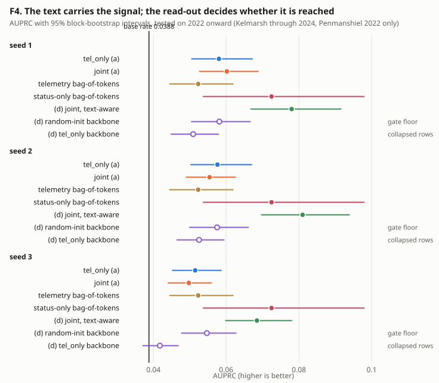
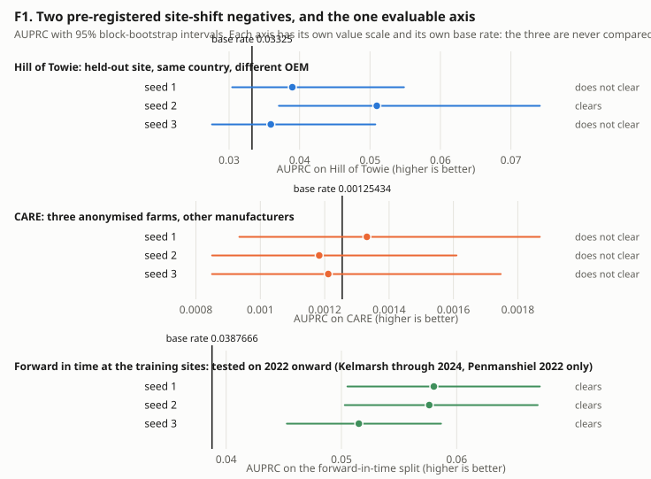
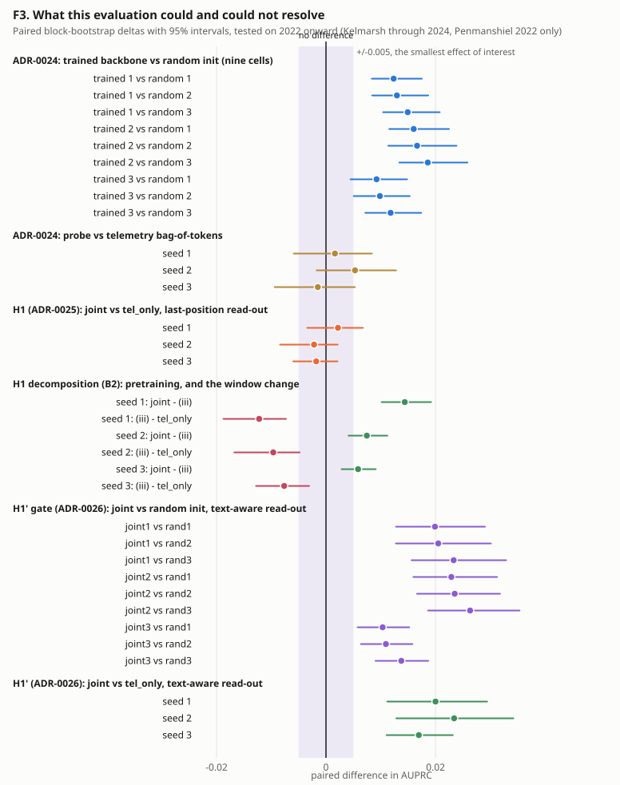
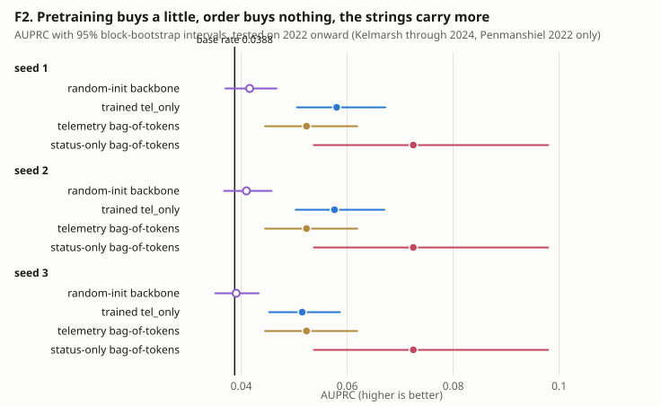
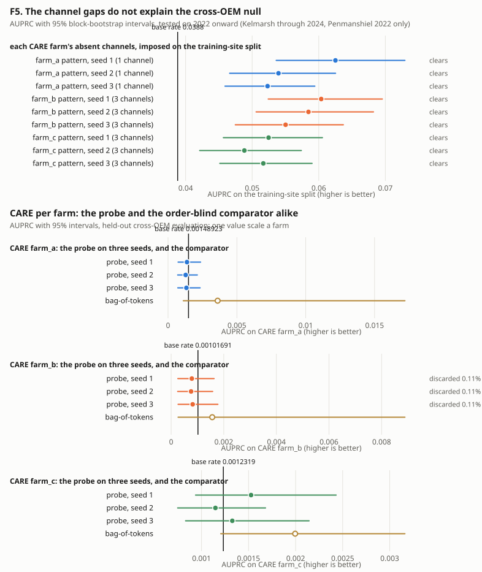
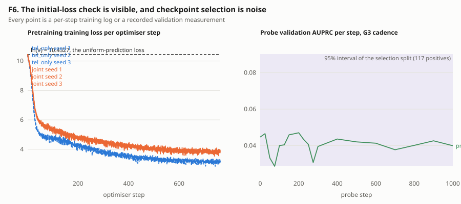

# Figures for the closed experimental programme

| field | value |
| --- | --- |
| what this is | every figure in the write-up, drawn from the committed record |
| retraining | none; every value is read from a tracked file |
| test split | tested on 2022 onward (Kelmarsh through 2024, Penmanshiel 2022 only) |
| standing caveat | forward-in-time, same sites; not a site-shift result |
| generated (UTC) | 2026-09-20T11:41:24+00:00 |
| git_sha | 6c3f4767404fe26cf33c21537d55ce21016b4c55 |
| generated by | faultline model figures |

## 1. The set

| figure | file | the sentence it supports |
| --- | --- | --- |
| F4. The H1/H1' mechanism | `fig4_readout_mechanism.svg` | The text carries the signal, the last-position read-out could not reach it, the text-aware read-out can, and the result lands level with counting the strings. |
| F1. The site-shift gate | `fig1_site_shift.svg` | Two pre-registered site-shift negatives; one evaluable axis. |
| F3. Every paired comparison in the record | `fig3_paired_deltas.svg` | What this evaluation could and could not resolve. |
| Ledger. The pre-registered gates | `ledger_gates.md` | Every rule was committed before the run it governs. |
| F2. The probe ladder | `fig2_probe_ladder.svg` | Pretraining buys a little, order buys nothing, the strings carry more than the telemetry. |
| F5. CARE attribution | `fig5_care_attribution.svg` | The channel gaps do not explain the cross-OEM null; the token stream does. |
| F6. Training diagnostics | `fig6_training.svg` | The initial-loss check is visible, and checkpoint selection on 117 positives is noise. |

## 2. Each figure, its sources and its caption

### F4. The H1/H1' mechanism

**The text carries the signal, the last-position read-out could not reach it, the text-aware read-out can, and the result lands level with counting the strings.**

Design (a) is the registered last-position probe; design (d) is ADR-0026's text-aware read-out. The two hollow rows are (d)'s controls: the random-init backbone is the floor the gate had to clear, and the telemetry-only backbone, whose text embedding rows collapsed onto one shared vector, is read with the same head. forward-in-time, same sites; not a site-shift result.

Sources:

- `reports/data/h1_gate_v0_20260919.json`
- `reports/data/h1_controls_v0_20260918.json`
- `reports/data/readout_v0_20260920.json`
- `reports/data/bag_of_tokens_v0_20260917.json`

### F1. The site-shift gate

**Two pre-registered site-shift negatives; one evaluable axis.**

A seed clears when its 95% lower bound is strictly above the scored set's own base rate. Hill of Towie clears on one seed of three and CARE on none, so neither axis is evaluable; the forward-in-time split clears on all three. The three base rates differ by more than a factor of thirty, so each panel is drawn on its own value scale against its own base-rate line, and the three are never compared by eye.

Sources:

- `reports/data/seed_replication_v0_20260917.json`
- `reports/data/axis_gate_v0_20260918.json`

### F3. Every paired comparison in the record

**What this evaluation could and could not resolve.**

Every model-versus-model comparison in the record is paired on the same resampled blocks. The shaded band is the registered smallest effect of interest. The H1 cluster sits inside it on all three seeds, which is what INCONCLUSIVE means here; the H1' cluster sits wholly outside it, as does its nine-cell instrument gate. forward-in-time, same sites; not a site-shift result.

Sources:

- `reports/data/seed_replication_v0_20260917.json`
- `reports/data/h1_gate_v0_20260919.json`
- `reports/data/readout_v0_20260920.json`
- `configs/eval/readout_v0.yaml`

### Ledger. The pre-registered gates

| ADR | question | registered | registering commit | outcome | outcome commit |
| --- | --- | --- | --- | --- | --- |
| ADR-0021 | The held-out-site gate: `tel_only` at full budget must put Hill of Towie's AUPRC interval above... | pre-registered 2026-09-16 | `ce9c8ad` | NOT EVALUABLE; leave-site-out is a reported negative, and the fallback is chosen under ADR-0022 | `ed60e8d` |
| ADR-0022 | The primary evaluation axis after ADR-0021: the selection rule, the CARE facts and scoring prot... | registered 2026-09-17 | `801ab71` | CARE is NOT EVALUABLE at chance on all three seeds; the in-distribution temporal split is EVALU... | `d87a524` |
| ADR-0023 | The random-init probe control: can the frozen probe see backbone quality? | pre-registered 2026-09-16 | `c9489a2` | FAIL: the final-position frozen probe cannot tell the trained backbone from an untrained one | `81a8fab` |
| ADR-0024 | The probe-sensitivity criterion is a paired test, and a bag-of-tokens comparator is reported be... | pre-registered 2026-09-17 | `79d4e97` | PASS: the final-position frozen probe sees the pretrained backbone; §a is the probe in force | `f6c2df0` |
| ADR-0025 | H1: the joint arm against `tel_only`, forward-in-time on the training sites | registered 2026-09-18 | `3e29202` | H1 is INCONCLUSIVE at this budget | `23699ee` |
| ADR-0026 | F7': is the read-out the limit? Text-aware linear probes on the existing joint backbones | registered 2026-09-20 | `319ae3b` | the gate PASSES and H1' is SUPPORTED | `9beebaa` |

**Every rule was committed before the run it governs.**

6 gates, ADR-0021 through ADR-0026, each read from its section of `docs/DECISIONS.md`. The rule was written into that file and committed in its own commit before the run it governs; the outcome was written under the rule afterwards. The outcome commit is the commit that wrote the outcome section, found by log rather than self-cited.

Sources:

- `docs/DECISIONS.md`

### F2. The probe ladder

**Pretraining buys a little, order buys nothing, the strings carry more than the telemetry.**

The random-init row is the same probe design on an untrained backbone of the same size; the gap to the trained row is what fifty million tokens of telemetry pretraining bought. The telemetry bag-of-tokens ignores token order entirely and is within noise of the trained probe. The status-only bag-of-tokens, a histogram of the window's status strings with no model at all, is above every telemetry row. The two bag rows are single fits, not per-seed, and repeat in each panel as a reference. forward-in-time, same sites; not a site-shift result.

Sources:

- `reports/data/seed_replication_v0_20260917.json`
- `reports/data/bag_of_tokens_v0_20260917.json`
- `reports/data/h1_controls_v0_20260918.json`

### F5. CARE attribution

**The channel gaps do not explain the cross-OEM null; the token stream does.**

Above: imposing each CARE farm's absent core channels on the training-site test split leaves the probe clear of the base rate on all nine farm-by-seed cells, so the channel gaps are not what nulls it. Below: on CARE itself the probe and the order-blind comparator both sit at each farm's own base rate, over a per-farm range of 0.0008 to 0.0015 AUPRC. The worst discarded-replicate share anywhere below is 0.11%, at farm_b, whose positives fall in the fewest blocks of the three; the pooled rows the rule actually reads discard nothing. Every panel has its own value scale and its own base-rate line, because CARE's base rates are about a thirtieth of the training sites'.

Sources:

- `reports/data/care_attribution_v0_20260918.json`
- `reports/data/axis_gate_v0_20260918.json`

### F6. Training diagnostics

**The initial-loss check is visible, and checkpoint selection on 117 positives is noise.**

Left: the per-step logs record **training** loss, not validation loss, so that is what is drawn; every run starts within a tenth of a nat of ln(V) over the joint vocabulary, which is the fail-fast guard passing in plain sight. Right: the G3 cadence's twenty validation measurements. The step-0 point is the untrained head, and it sits inside the selection split's own 95% interval, as does every later measurement -- which is why the fixed-final-step rule replaced validation-based checkpoint selection.

Sources:

- `reports/data/gate_check_v0_steps/S2_tel_only_seed1_lm.steps.csv`
- `reports/data/seed_replication_v0_steps/S2_tel_only_seed2_lm.steps.csv`
- `reports/data/seed_replication_v0_steps/S2_tel_only_seed3_lm.steps.csv`
- `reports/data/h1_arms_v0_steps/S2_joint_seed1_lm.steps.csv`
- `reports/data/h1_arms_v0_steps/S2_joint_seed2_lm.steps.csv`
- `reports/data/h1_arms_v0_steps/S2_joint_seed3_lm.steps.csv`
- `reports/data/probe_cadence_v0_20260917.json`
- `reports/data/seed_replication_v0_20260917.json`
- `reports/data/h1_controls_v0_20260918.json`
