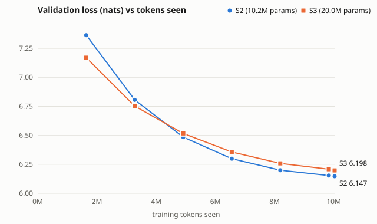

# Text ladder: loss against tokens seen, and terminal slopes

| field | value |
| --- | --- |
| source record | reports/data/text_pretrain_v1_20260916.json |
| retraining | none; every number is read from the record |
| measurement | validation next-token loss on the fixed selection subsample |
| slope unit | nats per million training tokens |
| terminal slope | the last full measurement interval (defined in src/faultline/evaluation/text_curves.py before it was read) |
| schedule | cosine to 0.1 of the peak rate at the last step |
| generated (UTC) | 2026-09-16T09:50:15+00:00 |
| git_sha | 8f9379fce0735bd7ba4d2aa5dd8a471e60909455 |
| generated by | faultline model text-curves |

## 1. The curves

| step | tokens seen | S2 loss | S3 loss | S3 - S2 |
| --- | --- | --- | --- | --- |
| 25 | 1,638,400 | 7.3642 | 7.1699 | -0.1943 |
| 50 | 3,276,800 | 6.8061 | 6.7531 | -0.0530 |
| 75 | 4,915,200 | 6.4851 | 6.5164 | +0.0313 |
| 100 | 6,553,600 | 6.2990 | 6.3568 | +0.0578 |
| 125 | 8,192,000 | 6.1991 | 6.2584 | +0.0594 |
| 150 | 9,830,400 | 6.1533 | 6.2080 | +0.0547 |
| 153 | 10,027,008 | 6.1474 | 6.1977 | +0.0503 |

## 2. Slope per interval (nats per million tokens)

| interval (steps) | tokens | S2 | S3 |
| --- | --- | --- | --- |
| 25 -> 50 | 1,638,400 | -0.3406 | -0.2544 |
| 50 -> 75 | 1,638,400 | -0.1959 | -0.1445 |
| 75 -> 100 | 1,638,400 | -0.1136 | -0.0974 |
| 100 -> 125 | 1,638,400 | -0.0610 | -0.0600 |
| 125 -> 150 | 1,638,400 | -0.0279 | -0.0308 |
| 150 -> 153 | 196,608 | -0.0301 | -0.0523 |

## 3. Terminal slopes

| rung | parameters | tokens | tokens per parameter | terminal slope (last full interval) | final interval |
| --- | --- | --- | --- | --- | --- |
| S2 | 10,227,072 | 10,027,008 | 0.98 | -0.0279 | -0.0301 |
| S3 | 19,986,624 | 10,027,008 | 0.50 | -0.0308 | -0.0523 |

**Is S3's terminal slope steeper than S2's? Yes:** -0.0308 against -0.0279 nats per million tokens (1.10x). Over the final interval: -0.0523 against -0.0301. This is one seed per rung, and no seed spread exists to set it against.

**The crossover question is open.** The measured curves already cross 1 time(s): between 3,276,800 and 4,915,200 tokens, where S3 goes from below S2 to above it. That is observed, not extrapolated, and it says nothing about a later crossing. Whether the larger rung would reach a lower loss than the smaller one with more tokens is not resolved either way by these curves. Both slopes were read at a learning rate decayed to 0.1 of its peak, so they are not the slopes a longer run would have. A linear extrapolation to a crossing point would treat them as if they were, so none is computed. Answering it needs runs whose schedules are sized for a larger token budget, and a corpus to supply those tokens.
